# Walmart Recruiting - Store Sales Forecasting

ეს რეპოზიტორია მოიცავს Kaggle-ის `Walmart Recruiting - Store Sales Forecasting` ამოცანაზე მუშაობას. მიზანია ისტორიული weekly sales მონაცემებით store-department დონეზე მომავალი გაყიდვების პროგნოზირება და სხვადასხვა time-series/modeling მიდგომის შედარება.

ამოცანა არის supervised forecasting: თითოეული ჩანაწერი აღწერს კონკრეტული `Store` + `Dept` წყვილის გაყიდვებს კონკრეტულ კვირაში. სამიზნე ცვლადია `Weekly_Sales`.

## მონაცემები

გამოყენებულია ოთხი ძირითადი ფაილი:

| ფაილი | აღწერა |
| --- | --- |
| `data/train.csv` | ისტორიული weekly sales, `2010-02-05` - `2012-10-26` |
| `data/test.csv` | საპროგნოზო პერიოდი, `2012-11-02` - `2013-07-26` |
| `data/features.csv` | store/date დონის გარე ფაქტორები: temperature, fuel price, markdowns, CPI, unemployment |
| `data/stores.csv` | store metadata: type და size |

Train set-ის ძირითადი ზომები:

- ჩანაწერები: 421,570
- stores: 45
- departments: 81
- weekly dates: 143
- unique Store/Dept pairs: 3,331
- holiday rows: დაახლოებით 7.04%
- საშუალო `Weekly_Sales`: 15,981.26
- მინიმალური/მაქსიმალური `Weekly_Sales`: -4,988.94 / 693,099.36

Test set-ში არის 115,064 ჩანაწერი და 3,169 unique Store/Dept pair. აქედან 11 Store/Dept pair train-ში საერთოდ არ გვხვდება, ამიტომ მოდელს სჭირდება cold-start fallback: store/type/size/dept/week aggregates და არა მხოლოდ historical lag-ები.

## EDA-ის მთავარი მიგნებები

### ვიზუალური ანალიზი

ქვემოთ მოცემული ფიგურები ამოღებულია `eda.ipynb`-ის output-ებიდან და ინახება `assets/eda/` საქაღალდეში.

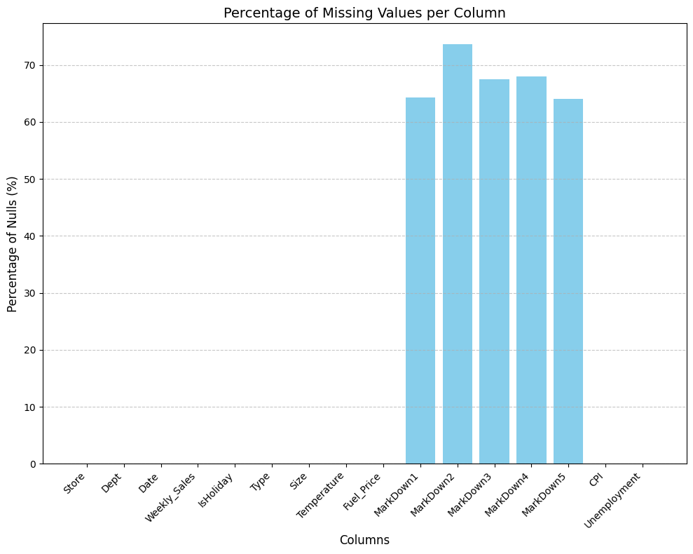

**Missing values:** missing მნიშვნელობები კონცენტრირებულია `MarkDown1` - `MarkDown5` სვეტებში. დანარჩენი ძირითადი სვეტები პრაქტიკულად სრულად შევსებულია, ამიტომ preprocessing-ის მთავარი რისკი promotional data-ს სწორ ინტერპრეტაციაზე მოდის. Markdown missingness არ უნდა ჩაითვალოს უბრალოდ random missing data-დ, რადგან იგი დროში მკაფიოდ სტრუქტურირებულია.

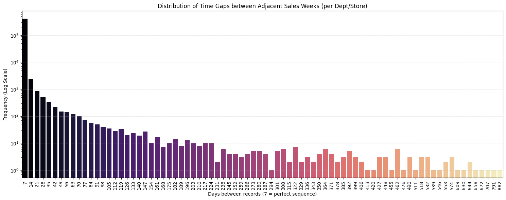

**Weekly gaps:** Store/Dept სერიების უმეტესობა 7-დღიან ინტერვალს მიჰყვება, რაც weekly forecasting-ს ამართლებს. გრაფიკზე ჩანს უფრო გრძელი gap-ებიც, ამიტომ lag/rolling features აუცილებლად უნდა დაითვალოს `Store` + `Dept` ჯგუფების შიგნით და არა მთელ dataset-ზე.

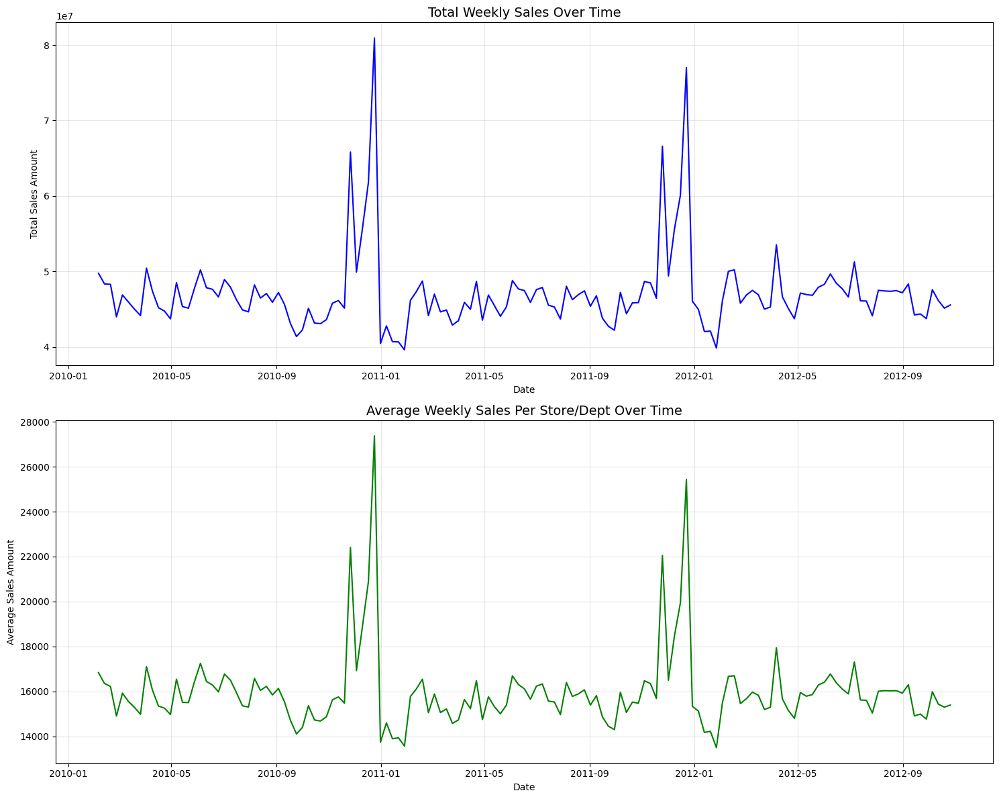

**Total weekly sales over time:** საერთო sales-ში ყველაზე მკვეთრი spikes მოდის წლის ბოლოს, განსაკუთრებით Thanksgiving/Christmas ფანჯარაში. ეს seasonal peak იმდენად ძლიერია, რომ calendar და holiday proximity features baseline მოდელშიც საჭიროა.

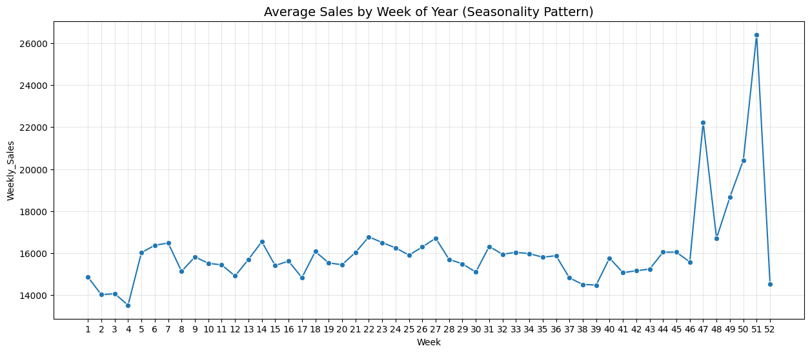

**Week-of-year seasonality:** საშუალო weekly sales წლის განმავლობაში შედარებით სტაბილურია, მაგრამ weeks 47-51 მკვეთრად გამოირჩევა. ყველაზე მაღალი პიკი week 51-ზე ჩანს, რაც Christmas-period demand-ს ასახავს.

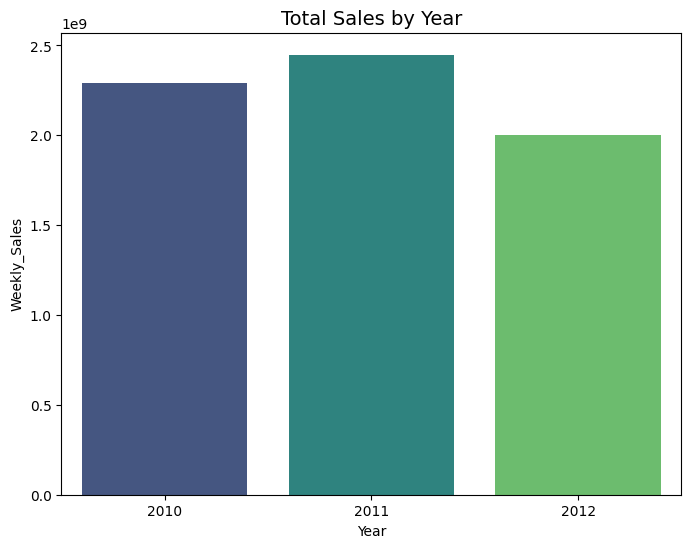

**Year totals:** 2011 წლის total sales 2010-ზე მაღალია, ხოლო 2012 დაბალია. 2012-ის ვარდნა პირდაპირ ბიზნეს-ვარდნად არ უნდა წავიკითხოთ, რადგან train period 2012-ში ოქტომბრამდე მთავრდება და ნოემბერ-დეკემბრის მაღალი სეზონი აკლია.

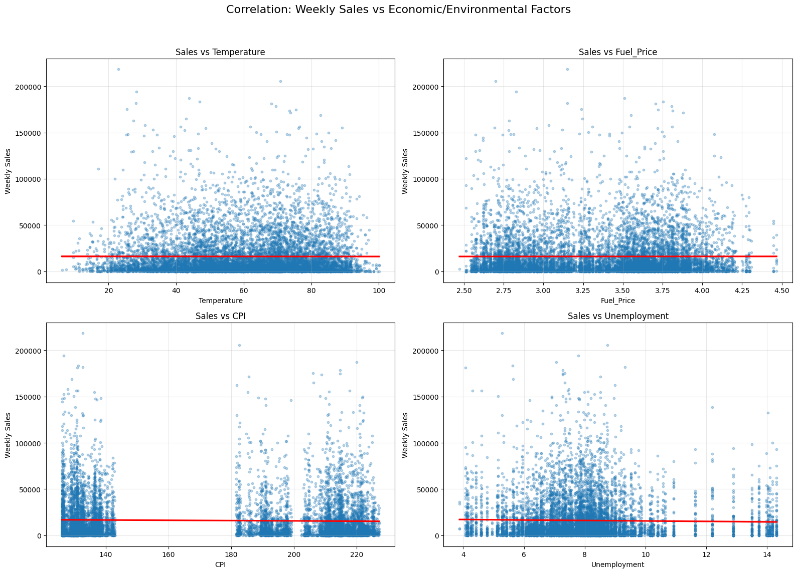

**External numeric factors:** `Temperature`, `Fuel_Price`, `CPI` და `Unemployment` scatterplot-ებში Weekly_Sales-ს ხაზობრივად სუსტად ხსნის. outlier-heavy sales distribution ჩანს ყველა subplot-ზე, რაც robust loss/metric-ს და tree-based nonlinear interaction-ების გამოყენებას ამართლებს.

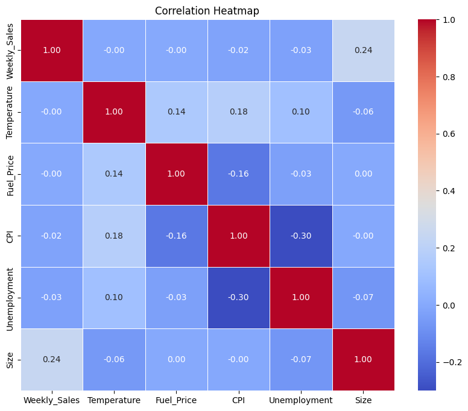

**External correlation heatmap:** Weekly_Sales-ს numeric external features-თან correlation თითქმის ნულოვანია: `Temperature` და `Fuel_Price` დაახლოებით `0.00`, `CPI` `-0.02`, `Unemployment` `-0.03`. `Size` ერთადერთი შედარებით მკაფიო numeric signal-ია (`0.24`), რაც store capacity/scale effect-ს აჩვენებს.

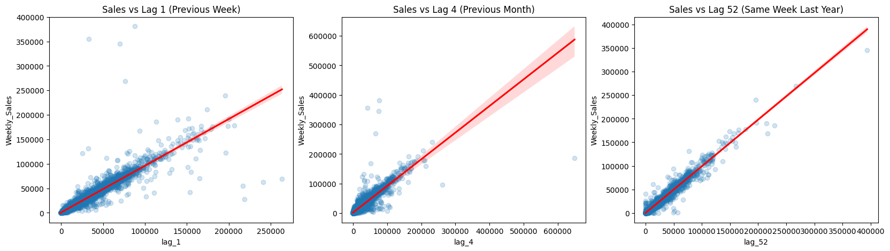

**Lag scatterplots:** `lag_1`, `lag_4` და `lag_52` Weekly_Sales-თან ძლიერ ხაზობრივ დამოკიდებულებას აჩვენებს. ეს ადასტურებს, რომ historical demand არის ყველაზე მნიშვნელოვანი signal, განსაკუთრებით წინა კვირის და წინა წლის იგივე სეზონური კვირის დონეზე.

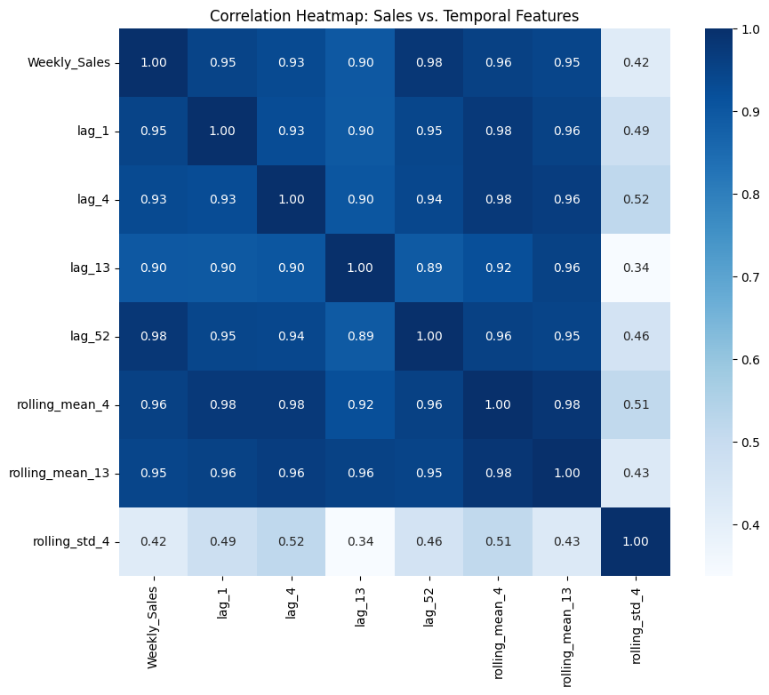

**Temporal feature correlations:** current sales-ს lag/rolling features-თან correlation ძალიან მაღალი აქვს: `lag_1` დაახლოებით `0.95`, `lag_4` `0.93`, `lag_13` `0.90`, `lag_52` `0.98`, `rolling_mean_4` `0.96`, `rolling_mean_13` `0.95`. `rolling_std_4` უფრო სუსტი, მაგრამ მაინც სასარგებლო volatility signal-ია (`0.42`).

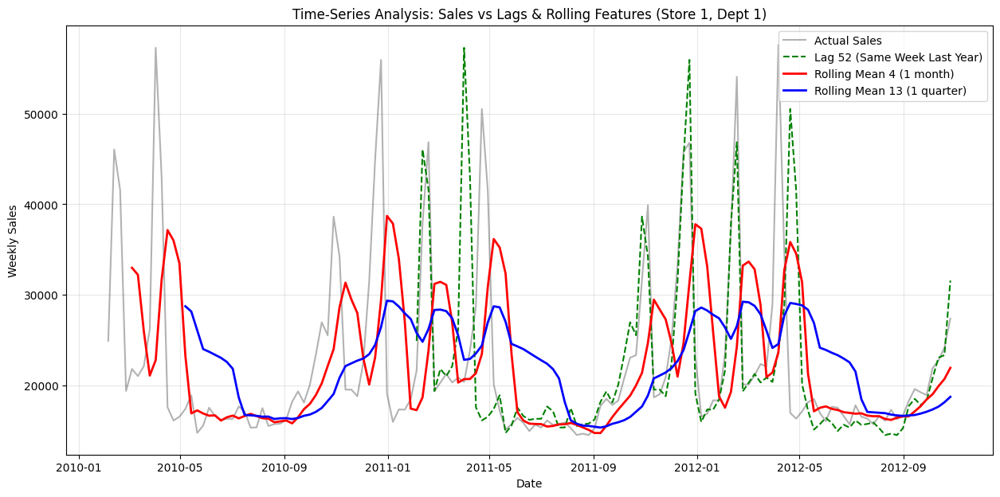

**Store 1 / Dept 1 time-series:** ერთი კონკრეტული Store/Dept სერია აჩვენებს, რომ lag და rolling mean რეალურ sales მოძრაობას კარგად მიჰყვება. rolling features noise-ს ამცირებს, ხოლო `lag_52` yearly seasonality-ს იჭერს.

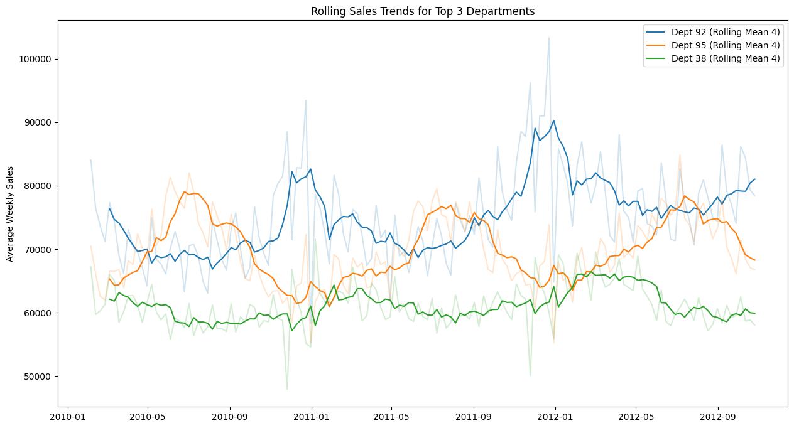

**Top department trends:** top departments-ს განსხვავებული baseline levels და seasonal მოძრაობა აქვს. ამიტომ `Dept` identity და department-level aggregates აუცილებელია, რადგან ერთი global average ყველა department-ს ერთნაირად ვერ აღწერს.

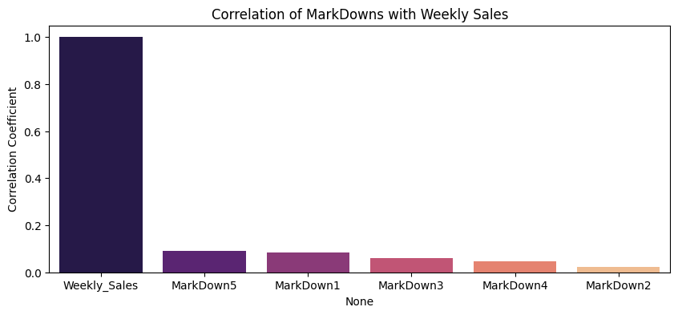

**Markdown correlations:** markdown amount columns-ს Weekly_Sales-თან მხოლოდ სუსტი positive correlation აქვს. ეს არ ნიშნავს, რომ promotions უსარგებლოა; უფრო სავარაუდოა, რომ ეფექტი department, store type და holiday context-ზეა დამოკიდებული.

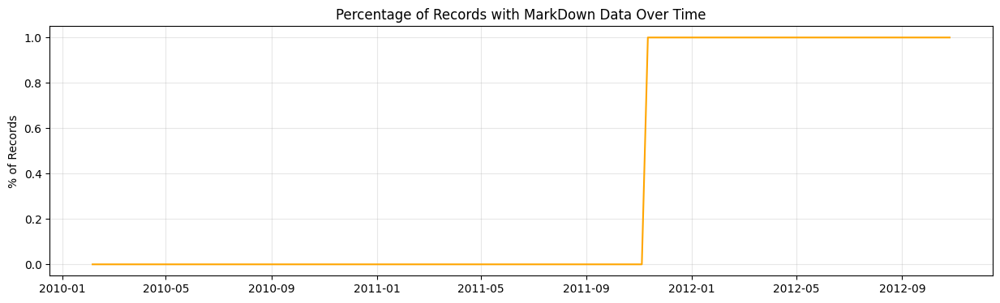

**Markdown availability:** markdown data დროში ერთიანად ჩნდება, დაახლოებით 2011 წლის ნოემბრიდან. ამის გამო missing indicator-ები (`has_markdown_*`) მნიშვნელოვანია და markdown missing values-ის 0-ით შევსება მხოლოდ explicit assumption-ით უნდა გაკეთდეს.

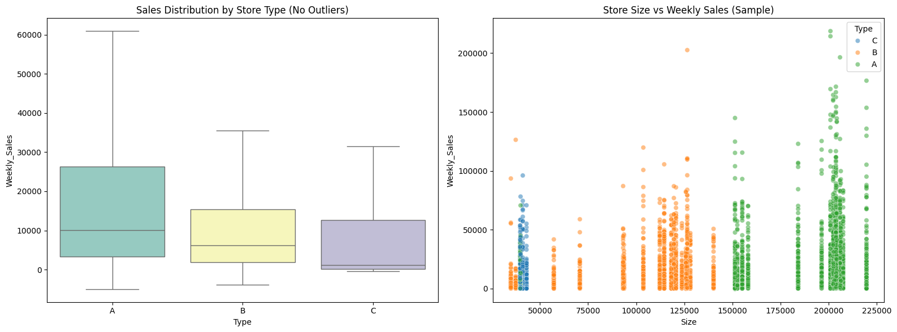

**Store type and size:** Type A stores უფრო მაღალ sales distribution-ს აჩვენებს, Type C შედარებით დაბალს. scatterplot-ში ერთი და იმავე size-ის stores-შიც დიდი variation ჩანს, ამიტომ მხოლოდ `Type` და `Size` საკმარისი არ არის `Store`, `Dept` და historical aggregates-ის გარეშე.

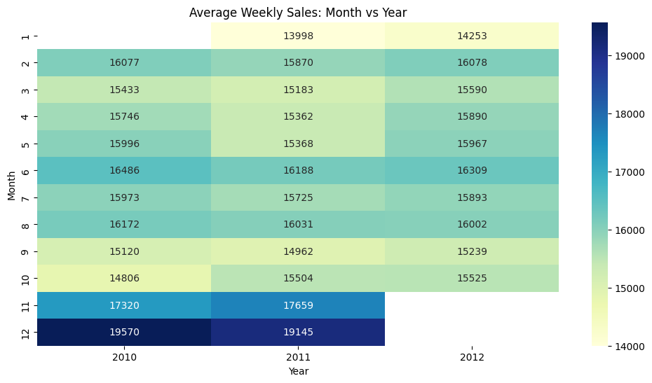

**Month vs year heatmap:** ნოემბერი და დეკემბერი ყველაზე მაღალი საშუალო weekly sales-ის თვეებია, ხოლო 2012-ში ეს თვეები ცარიელია train cutoff-ის გამო. Validation split-ის დაგეგმვისას ეს cutoff აუცილებლად უნდა გავითვალისწინოთ, რომ model evaluation-მა holiday demand არ გამოტოვოს.

### დროითი სტრუქტურა

Store/Dept დონეზე ჩანაწერები ძირითადად 7-დღიანი ინტერვალით მოდის, რაც ამოცანას რეგულარულ weekly time-series ფორმატთან აახლოებს. იშვიათად გვხვდება უფრო დიდი gap-ებიც, ამიტომ lag და rolling feature-ები აუცილებლად უნდა დაითვალოს თითოეული `Store` + `Dept` ჯგუფის შიგნით.

საერთო weekly sales საკმაოდ სტაბილურია, მაგრამ მკვეთრი peaks ჩანს ნოემბერ-დეკემბერში. ყველაზე ძლიერი სეზონურობა მოდის Thanksgiving/Christmas პერიოდზე. Week-of-year ანალიზში ყველაზე მაღალი საშუალო გაყიდვები აქვს week 51-ს, შემდეგ week 47, 50 და 49.

2012 წლის yearly total 2010/2011-ზე დაბალია, მაგრამ ეს პირდაპირ yearly performance-ად არ უნდა განვიხილოთ, რადგან train data 2012-ში მხოლოდ ოქტომბრამდეა.

### Holiday ეფექტი

Holiday weeks მცირე ნაწილია, მაგრამ გაყიდვებზე ძლიერი გავლენა აქვს. განსაკუთრებით მნიშვნელოვანია:

- Thanksgiving
- Christmas
- Super Bowl
- Labor Day

მოდელირებისთვის მხოლოდ `IsHoliday` საკმარისი არ არის. უკეთესია დამატებითი calendar features:

- `week_of_year`
- `month`
- `year`
- holiday name
- holiday proximity, მაგალითად რამდენი კვირაა დარჩენილი Thanksgiving-მდე ან Christmas-მდე

### ეკონომიკური და გარემო ფაქტორები

`Temperature`, `Fuel_Price`, `CPI` და `Unemployment` Weekly_Sales-თან თითქმის ნულოვან linear correlation-ს აჩვენებს. ეს ნიშნავს, რომ ცალკე აღებული ეს სვეტები გაყიდვებს პირდაპირ ვერ ხსნის.

თუმცა მათი წაშლა ავტომატურად სწორი არ არის, რადგან ეფექტი შეიძლება იყოს:

- nonlinear
- store-specific
- department-specific
- seasonal interaction-ის ნაწილი

მაგალითად, temperature სავარაუდოდ სხვადასხვა department-ზე განსხვავებულად მოქმედებს. Tree-based მოდელებს, როგორიცაა LightGBM და XGBoost, ასეთი interaction-ების დაჭერა უკეთ შეუძლიათ.

### Store type და size

`Size` Weekly_Sales-თან შედარებით უფრო მკაფიო signal-ს იძლევა, ვიდრე ეკონომიკური ცვლადები. Type A stores უფრო დიდია და უფრო მაღალი sales distribution აქვს. Type C stores შედარებით პატარაა და median sales დაბალია.

მიუხედავად ამისა, scatterplot აჩვენებს დიდ variation-ს ერთი და იმავე size-ის stores-შიც. ამიტომ საჭიროა categorical identifiers:

- `Store`
- `Dept`
- `Type`
- Store/Dept historical aggregates

### Markdown მონაცემები

Markdown columns (`MarkDown1` - `MarkDown5`) promotional data-ს აღწერს, მაგრამ train-ის დიდ ნაწილში missing არის. Markdown data ფაქტობრივად ჩნდება `2011-11-11`-დან, ამიტომ missingness თვითონაც ინფორმაციულია.

რეკომენდებული დამუშავება:

- amount columns-ის შევსება 0-ით მხოლოდ იმ შემთხვევაში, თუ ამას ვხსნით როგორც no markdown
- დამატებითი binary indicators: `has_markdown_1`, ..., `has_markdown_5`
- optional total markdown feature
- holiday/week interaction-ები markdown-ებთან

Markdown correlations Weekly_Sales-თან სუსტია, მაგრამ positive. promotion effect სავარაუდოდ department და holiday context-ზეა დამოკიდებული.

### Lag და rolling features

EDA-ის ყველაზე ძლიერი დასკვნაა, რომ historical sales features ყველაზე ინფორმაციულია. Current `Weekly_Sales` ძალიან ძლიერად უკავშირდება:

- `lag_1`: წინა კვირა
- `lag_4`: დაახლოებით წინა თვე
- `lag_13`: წინა კვარტალი
- `lag_52`: იგივე კვირა წინა წელს
- `rolling_mean_4`
- `rolling_mean_13`

ამ feature-ების შექმნისას აუცილებელია leakage control: rolling statistics უნდა დაითვალოს `.shift(1)`-ის შემდეგ, ანუ მხოლოდ წარსული კვირებიდან. `eda.ipynb`-ში rolling feature-ები დათვლილია `Store` + `Dept` ჯგუფების შიგნით.

## Feature Engineering სტრატეგია

EDA-ზე დაყრდნობით გამოყენებული/რეკომენდებული feature groups:

### Calendar features

- year
- month
- week_of_year
- quarter
- is_holiday
- holiday name
- weeks to/from major holidays

### Historical sales features

- lag 1, 4, 13, 52
- rolling mean 4, 13
- rolling std 4, 13
- expanding mean per Store/Dept

### Store and department features

- Store
- Dept
- Type
- Size
- Store-level average sales
- Dept-level average sales
- Store/Dept pair-level historical statistics

### External features

- Temperature
- Fuel_Price
- CPI
- Unemployment
- MarkDown1-5
- Markdown availability indicators

## Modeling მიდგომები

რეპოზიტორიაში გამოყოფილია ცალკე notebook-ები სხვადასხვა არქიტექტურისთვის:

| Notebook | მოდელი |
| --- | --- |
| `models/model_experiment_XGBoost.ipynb` | XGBoost |
| `models/model_experiment_LightGBM.ipynb` | LightGBM |
| `models/model_experiment_ARIMA.ipynb` | ARIMA |
| `models/model_experiment_SARIMA.ipynb` | SARIMA |
| `models/model_experiment_N-BEATS.ipynb` | N-BEATS |
| `models/model_experiment_DLinear.ipynb` | DLinear |
| `models/model_experiment_TFT.ipynb` | Temporal Fusion Transformer |
| `models/model_experiment_PatchTFT.ipynb` | PatchTFT |
| `models/model_experiment_TimesFM.ipynb` | TimesFM |

EDA-ის მიხედვით baseline-ისთვის ყველაზე პრაქტიკული კანდიდატებია LightGBM/XGBoost lag და rolling feature-ებით, რადგან:

- tabular data-ს კარგად იყენებენ
- categorical/store/dept aggregates-თან მარტივად მუშაობენ
- nonlinear interaction-ებს იჭერენ
- external features-ის weak signal-საც საჭიროების შემთხვევაში გამოიყენებენ

Classical ARIMA/SARIMA სასარგებლოა თეორიული benchmark-ისთვის, მაგრამ 3,000-ზე მეტი Store/Dept სერიის გამო production-style გადაწყვეტად მძიმეა. Deep learning მოდელები უკეთესია global forecasting-ისთვის, თუმცა საჭიროებს ფრთხილ validation-ს და feature scaling/encoding-ს.

## Validation

რადგან მონაცემი time-series არის, random split არ არის სწორი. რეკომენდებულია time-based validation:

- train: ძველი კვირები
- validation: ბოლო რამდენიმე თვე train period-იდან
- test/inference: Kaggle test period

შეფასებისას სასურველია Kaggle competition metric-ის გამოყენება: weighted mean absolute error, სადაც holiday weeks უფრო მაღალი წონით ფასდება.

## Repository Structure

```text
.
|-- README.md
|-- eda.ipynb
|-- model_inference.ipynb
|-- assets/
|   `-- eda/
|       |-- 01_missing_values.png
|       |-- 02_weekly_gap_distribution.png
|       |-- 03_total_weekly_sales_over_time.png
|       |-- 04_average_sales_by_week_of_year.png
|       |-- 05_average_sales_by_week_of_year_detail.png
|       |-- 06_sales_vs_external_factors.png
|       |-- 07_correlation_heatmap.png
|       |-- 08_sales_vs_lag_features.png
|       |-- 09_temporal_features_correlation_heatmap.png
|       |-- 10_store1_dept1_lag_rolling_analysis.png
|       |-- 11_top_departments_rolling_trends.png
|       |-- 12_markdown_sales_correlation.png
|       |-- 13_markdown_sales_correlation_detail.png
|       |-- 14_sales_distribution_by_store_type.png
|       `-- 15_average_weekly_sales_month_vs_year.png
|-- data/
|   |-- train.csv
|   |-- test.csv
|   |-- features.csv
|   `-- stores.csv
`-- models/
    |-- model_experiment_ARIMA.ipynb
    |-- model_experiment_SARIMA.ipynb
    |-- model_experiment_XGBoost.ipynb
    |-- model_experiment_LightGBM.ipynb
    |-- model_experiment_N-BEATS.ipynb
    |-- model_experiment_DLinear.ipynb
    |-- model_experiment_TFT.ipynb
    |-- model_experiment_PatchTFT.ipynb
    `-- model_experiment_TimesFM.ipynb
```

## მოკლე დასკვნა

ამ მონაცემებში forecasting-ის მთავარი წყაროა წარსული გაყიდვები და yearly/holiday seasonality. Store size/type და department identity ასევე მნიშვნელოვანია. ეკონომიკური ცვლადები და markdowns ცალკე სუსტად ჩანს, მაგრამ interaction-ებში შეიძლება სასარგებლო იყოს. საბოლოო მოდელებისთვის ყველაზე ძლიერი საწყისი მიმართულებაა global tree-based model lag/rolling/calendar/store features-ებით, შემდეგ კი deep learning/global time-series არქიტექტურებთან შედარება.
