# Walmart Recruiting - Store Sales Forecasting

ეს რეპოზიტორია მოიცავს Kaggle-ის `Walmart Recruiting - Store Sales Forecasting` ამოცანაზე მუშაობას. მიზანია ისტორიული weekly sales მონაცემებით store-department დონეზე მომავალი გაყიდვების პროგნოზირება და სხვადასხვა time-series/modeling მიდგომის შედარება.

ამოცანა არის supervised forecasting: თითოეული ჩანაწერი აღწერს კონკრეტული `Store` + `Dept` წყვილის გაყიდვებს კონკრეტულ კვირაში. სამიზნე ცვლადია `Weekly_Sales`.

## მონაცემები

გამოყენებულია ოთხი ძირითადი ფაილი:

| ფაილი | აღწერა |
| --- | --- |
| `data/train.csv` | ისტორიული weekly sales, `2010-02-05` - `2012-10-26` |
| `data/test.csv` | საპროგნოზო პერიოდი, `2012-11-02` - `2013-07-26` |
| `data/features.csv` | store/date დონის გარე ფაქტორები: temperature, fuel price, markdowns, CPI, unemployment |
| `data/stores.csv` | store metadata: type და size |

Train set-ის ძირითადი ზომები:

- ჩანაწერები: 421,570
- stores: 45
- departments: 81
- weekly dates: 143
- unique Store/Dept pairs: 3,331
- holiday rows: დაახლოებით 7.04%
- საშუალო `Weekly_Sales`: 15,981.26
- მინიმალური/მაქსიმალური `Weekly_Sales`: -4,988.94 / 693,099.36

Test set-ში არის 115,064 ჩანაწერი და 3,169 unique Store/Dept pair. აქედან 11 Store/Dept pair train-ში საერთოდ არ გვხვდება, ამიტომ მოდელს სჭირდება cold-start fallback: store/type/size/dept/week aggregates და არა მხოლოდ historical lag-ები.

## EDA-ის მთავარი მიგნებები

### ვიზუალური ანალიზი

ქვემოთ მოცემული ფიგურები ამოღებულია `eda.ipynb`-ის output-ებიდან და ინახება `assets/eda/` საქაღალდეში.

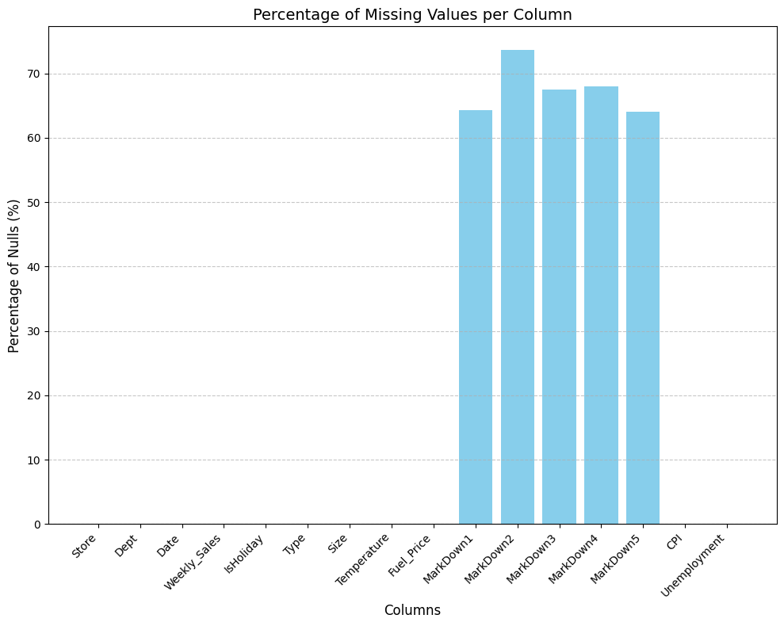

**Missing values:** missing მნიშვნელობები კონცენტრირებულია `MarkDown1` - `MarkDown5` სვეტებში. დანარჩენი ძირითადი სვეტები პრაქტიკულად სრულად შევსებულია, ამიტომ preprocessing-ის მთავარი რისკი promotional data-ს სწორ ინტერპრეტაციაზე მოდის. Markdown missingness არ უნდა ჩაითვალოს უბრალოდ random missing data-დ, რადგან იგი დროში მკაფიოდ სტრუქტურირებულია.

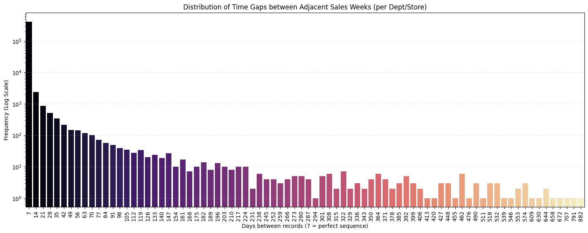

**Weekly gaps:** Store/Dept სერიების უმეტესობა 7-დღიან ინტერვალს მიჰყვება, რაც weekly forecasting-ს ამართლებს. გრაფიკზე ჩანს უფრო გრძელი gap-ებიც, ამიტომ lag/rolling features აუცილებლად უნდა დაითვალოს `Store` + `Dept` ჯგუფების შიგნით და არა მთელ dataset-ზე.

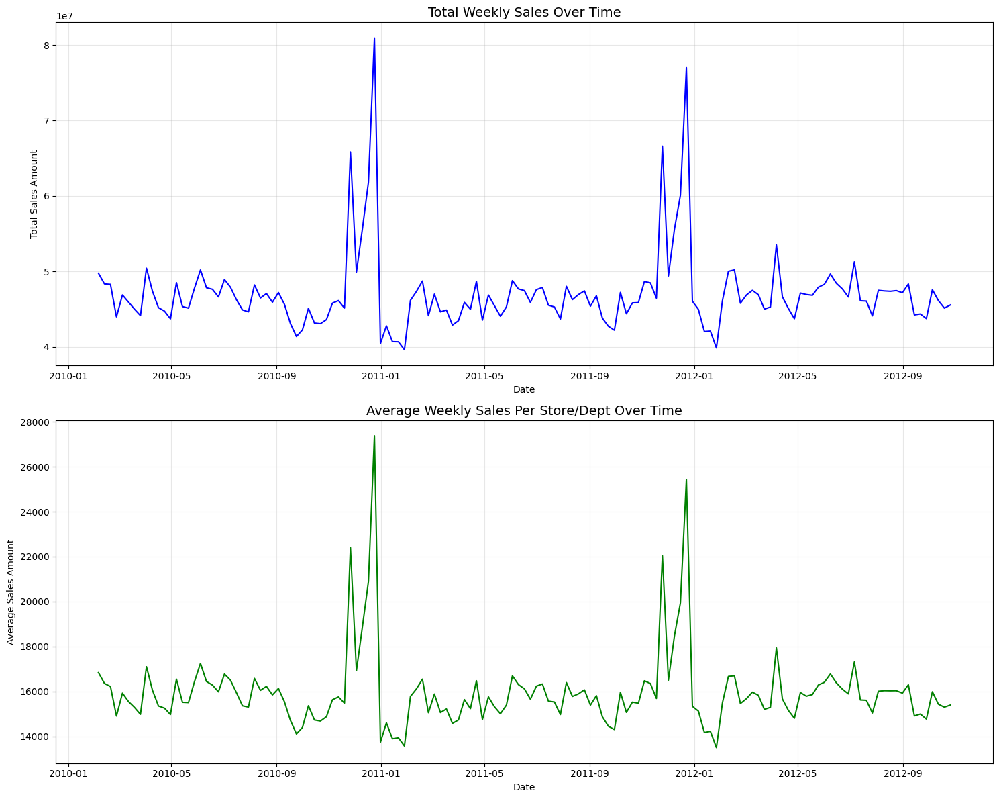

**Total weekly sales over time:** საერთო sales-ში ყველაზე მკვეთრი spikes მოდის წლის ბოლოს, განსაკუთრებით Thanksgiving/Christmas ფანჯარაში. ეს seasonal peak იმდენად ძლიერია, რომ calendar და holiday proximity features baseline მოდელშიც საჭიროა.

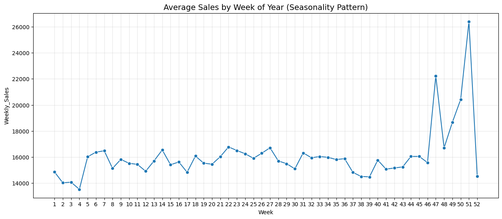

**Week-of-year seasonality:** საშუალო weekly sales წლის განმავლობაში შედარებით სტაბილურია, მაგრამ weeks 47-51 მკვეთრად გამოირჩევა. ყველაზე მაღალი პიკი week 51-ზე ჩანს, რაც Christmas-period demand-ს ასახავს.

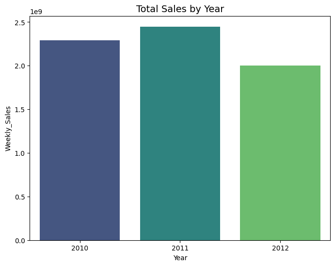

**Year totals:** 2011 წლის total sales 2010-ზე მაღალია, ხოლო 2012 დაბალია. 2012-ის ვარდნა პირდაპირ ბიზნეს-ვარდნად არ უნდა წავიკითხოთ, რადგან train period 2012-ში ოქტომბრამდე მთავრდება და ნოემბერ-დეკემბრის მაღალი სეზონი აკლია.

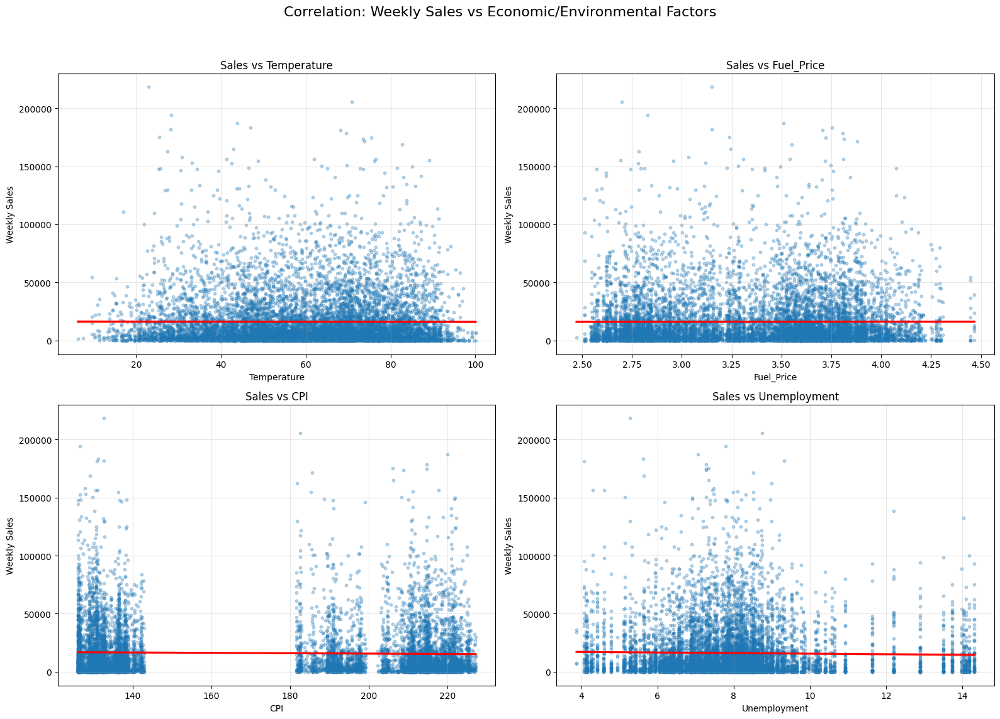

**External numeric factors:** `Temperature`, `Fuel_Price`, `CPI` და `Unemployment` scatterplot-ებში Weekly_Sales-ს ხაზობრივად სუსტად ხსნის. outlier-heavy sales distribution ჩანს ყველა subplot-ზე, რაც robust loss/metric-ს და tree-based nonlinear interaction-ების გამოყენებას ამართლებს.

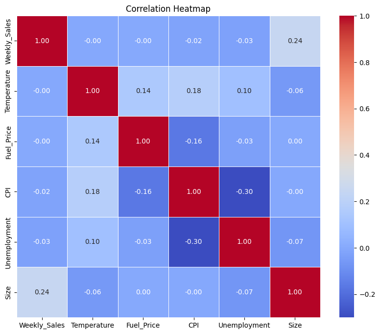

**External correlation heatmap:** Weekly_Sales-ს numeric external features-თან correlation თითქმის ნულოვანია: `Temperature` და `Fuel_Price` დაახლოებით `0.00`, `CPI` `-0.02`, `Unemployment` `-0.03`. `Size` ერთადერთი შედარებით მკაფიო numeric signal-ია (`0.24`), რაც store capacity/scale effect-ს აჩვენებს.

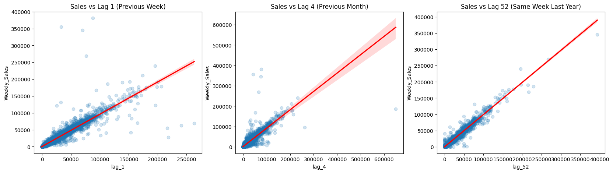

**Lag scatterplots:** `lag_1`, `lag_4` და `lag_52` Weekly_Sales-თან ძლიერ ხაზობრივ დამოკიდებულებას აჩვენებს. ეს ადასტურებს, რომ historical demand არის ყველაზე მნიშვნელოვანი signal, განსაკუთრებით წინა კვირის და წინა წლის იგივე სეზონური კვირის დონეზე.

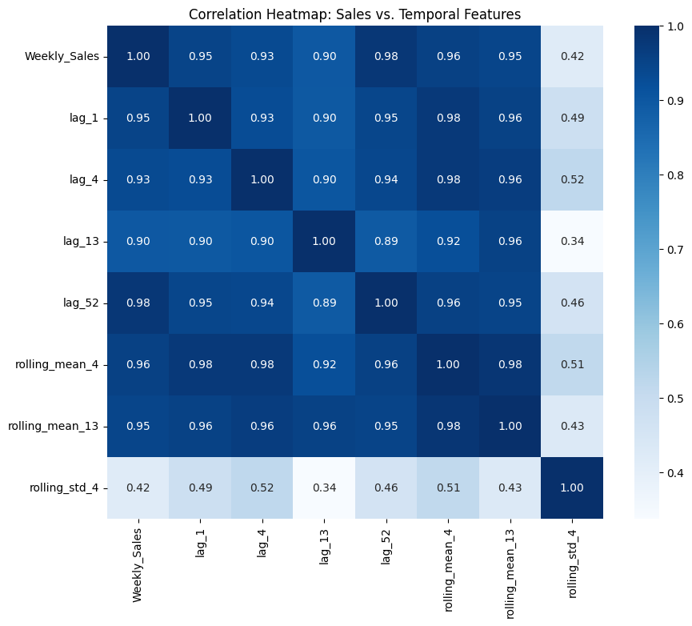

**Temporal feature correlations:** current sales-ს lag/rolling features-თან correlation ძალიან მაღალი აქვს: `lag_1` დაახლოებით `0.95`, `lag_4` `0.93`, `lag_13` `0.90`, `lag_52` `0.98`, `rolling_mean_4` `0.96`, `rolling_mean_13` `0.95`. `rolling_std_4` უფრო სუსტი, მაგრამ მაინც სასარგებლო volatility signal-ია (`0.42`).

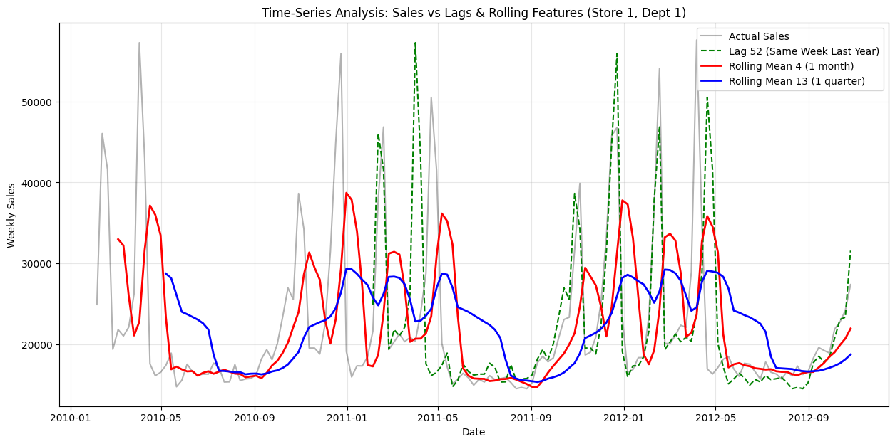

**Store 1 / Dept 1 time-series:** ერთი კონკრეტული Store/Dept სერია აჩვენებს, რომ lag და rolling mean რეალურ sales მოძრაობას კარგად მიჰყვება. rolling features noise-ს ამცირებს, ხოლო `lag_52` yearly seasonality-ს იჭერს.

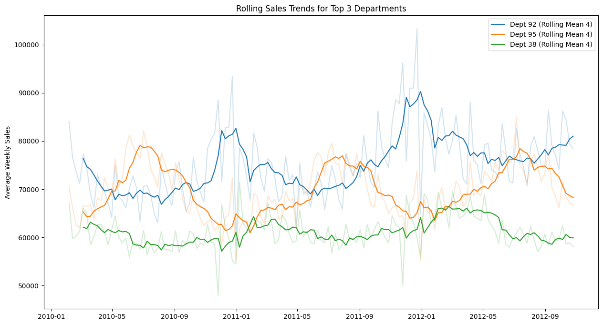

**Top department trends:** top departments-ს განსხვავებული baseline levels და seasonal მოძრაობა აქვს. ამიტომ `Dept` identity და department-level aggregates აუცილებელია, რადგან ერთი global average ყველა department-ს ერთნაირად ვერ აღწერს.

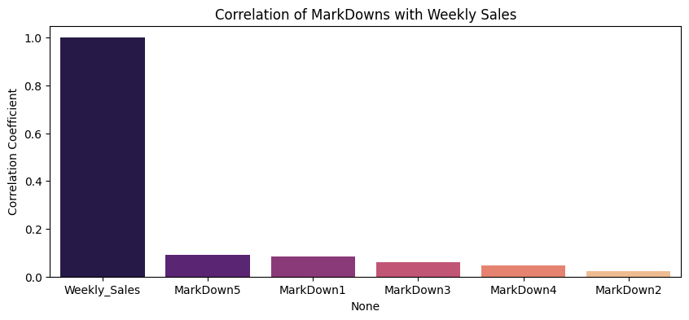

**Markdown correlations:** markdown amount columns-ს Weekly_Sales-თან მხოლოდ სუსტი positive correlation აქვს. ეს არ ნიშნავს, რომ promotions უსარგებლოა; უფრო სავარაუდოა, რომ ეფექტი department, store type და holiday context-ზეა დამოკიდებული.

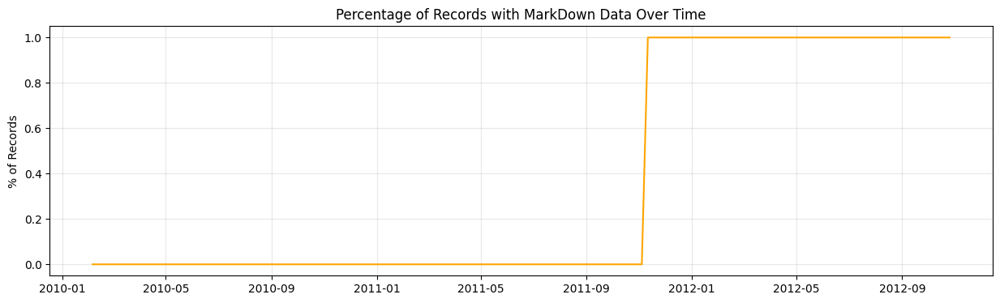

**Markdown availability:** markdown data დროში ერთიანად ჩნდება, დაახლოებით 2011 წლის ნოემბრიდან. ამის გამო missing indicator-ები (`has_markdown_*`) მნიშვნელოვანია და markdown missing values-ის 0-ით შევსება მხოლოდ explicit assumption-ით უნდა გაკეთდეს.

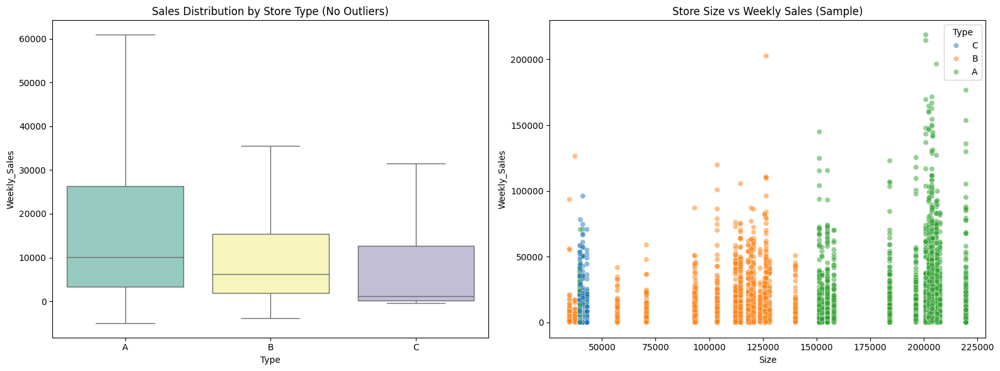

**Store type and size:** Type A stores უფრო მაღალ sales distribution-ს აჩვენებს, Type C შედარებით დაბალს. scatterplot-ში ერთი და იმავე size-ის stores-შიც დიდი variation ჩანს, ამიტომ მხოლოდ `Type` და `Size` საკმარისი არ არის `Store`, `Dept` და historical aggregates-ის გარეშე.

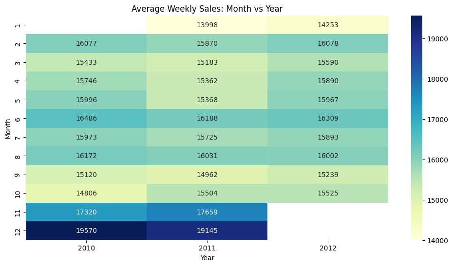

**Month vs year heatmap:** ნოემბერი და დეკემბერი ყველაზე მაღალი საშუალო weekly sales-ის თვეებია, ხოლო 2012-ში ეს თვეები ცარიელია train cutoff-ის გამო. Validation split-ის დაგეგმვისას ეს cutoff აუცილებლად უნდა გავითვალისწინოთ, რომ model evaluation-მა holiday demand არ გამოტოვოს.

### დროითი სტრუქტურა

Store/Dept დონეზე ჩანაწერები ძირითადად 7-დღიანი ინტერვალით მოდის, რაც ამოცანას რეგულარულ weekly time-series ფორმატთან აახლოებს. იშვიათად გვხვდება უფრო დიდი gap-ებიც, ამიტომ lag და rolling feature-ები აუცილებლად უნდა დაითვალოს თითოეული `Store` + `Dept` ჯგუფის შიგნით.

საერთო weekly sales საკმაოდ სტაბილურია, მაგრამ მკვეთრი peaks ჩანს ნოემბერ-დეკემბერში. ყველაზე ძლიერი სეზონურობა მოდის Thanksgiving/Christmas პერიოდზე. Week-of-year ანალიზში ყველაზე მაღალი საშუალო გაყიდვები აქვს week 51-ს, შემდეგ week 47, 50 და 49.

2012 წლის yearly total 2010/2011-ზე დაბალია, მაგრამ ეს პირდაპირ yearly performance-ად არ უნდა განვიხილოთ, რადგან train data 2012-ში მხოლოდ ოქტომბრამდეა.

### Holiday ეფექტი

Holiday weeks მცირე ნაწილია, მაგრამ გაყიდვებზე ძლიერი გავლენა აქვს. განსაკუთრებით მნიშვნელოვანია:

- Thanksgiving
- Christmas
- Super Bowl
- Labor Day

მოდელირებისთვის მხოლოდ `IsHoliday` საკმარისი არ არის. უკეთესია დამატებითი calendar features:

- `week_of_year`
- `month`
- `year`
- holiday name
- holiday proximity, მაგალითად რამდენი კვირაა დარჩენილი Thanksgiving-მდე ან Christmas-მდე

### ეკონომიკური და გარემო ფაქტორები

`Temperature`, `Fuel_Price`, `CPI` და `Unemployment` Weekly_Sales-თან თითქმის ნულოვან linear correlation-ს აჩვენებს. ეს ნიშნავს, რომ ცალკე აღებული ეს სვეტები გაყიდვებს პირდაპირ ვერ ხსნის.

თუმცა მათი წაშლა ავტომატურად სწორი არ არის, რადგან ეფექტი შეიძლება იყოს:

- nonlinear
- store-specific
- department-specific
- seasonal interaction-ის ნაწილი

მაგალითად, temperature სავარაუდოდ სხვადასხვა department-ზე განსხვავებულად მოქმედებს. Tree-based მოდელებს, როგორიცაა LightGBM და XGBoost, ასეთი interaction-ების დაჭერა უკეთ შეუძლიათ.

### Store type და size

`Size` Weekly_Sales-თან შედარებით უფრო მკაფიო signal-ს იძლევა, ვიდრე ეკონომიკური ცვლადები. Type A stores უფრო დიდია და უფრო მაღალი sales distribution აქვს. Type C stores შედარებით პატარაა და median sales დაბალია.

მიუხედავად ამისა, scatterplot აჩვენებს დიდ variation-ს ერთი და იმავე size-ის stores-შიც. ამიტომ საჭიროა categorical identifiers:

- `Store`
- `Dept`
- `Type`
- Store/Dept historical aggregates

### Markdown მონაცემები

Markdown columns (`MarkDown1` - `MarkDown5`) promotional data-ს აღწერს, მაგრამ train-ის დიდ ნაწილში missing არის. Markdown data ფაქტობრივად ჩნდება `2011-11-11`-დან, ამიტომ missingness თვითონაც ინფორმაციულია.

რეკომენდებული დამუშავება:

- amount columns-ის შევსება 0-ით მხოლოდ იმ შემთხვევაში, თუ ამას ვხსნით როგორც no markdown
- დამატებითი binary indicators: `has_markdown_1`, ..., `has_markdown_5`
- optional total markdown feature
- holiday/week interaction-ები markdown-ებთან

Markdown correlations Weekly_Sales-თან სუსტია, მაგრამ positive. promotion effect სავარაუდოდ department და holiday context-ზეა დამოკიდებული.

### Lag და rolling features

EDA-ის ყველაზე ძლიერი დასკვნაა, რომ historical sales features ყველაზე ინფორმაციულია. Current `Weekly_Sales` ძალიან ძლიერად უკავშირდება:

- `lag_1`: წინა კვირა
- `lag_4`: დაახლოებით წინა თვე
- `lag_13`: წინა კვარტალი
- `lag_52`: იგივე კვირა წინა წელს
- `rolling_mean_4`
- `rolling_mean_13`

ამ feature-ების შექმნისას აუცილებელია leakage control: rolling statistics უნდა დაითვალოს `.shift(1)`-ის შემდეგ, ანუ მხოლოდ წარსული კვირებიდან. `eda.ipynb`-ში rolling feature-ები დათვლილია `Store` + `Dept` ჯგუფების შიგნით.

## Feature Engineering სტრატეგია

EDA-ზე დაყრდნობით გამოყენებული/რეკომენდებული feature groups:

### Calendar features

- year
- month
- week_of_year
- quarter
- is_holiday
- holiday name
- weeks to/from major holidays

### Historical sales features

- lag 1, 4, 13, 52
- rolling mean 4, 13
- rolling std 4, 13
- expanding mean per Store/Dept

### Store and department features

- Store
- Dept
- Type
- Size
- Store-level average sales
- Dept-level average sales
- Store/Dept pair-level historical statistics

### External features

- Temperature
- Fuel_Price
- CPI
- Unemployment
- MarkDown1-5
- Markdown availability indicators

## პროექტის ექსპერიმენტული სტრატეგია

ამ პროექტში მიზანი ერთი ძლიერი notebook-ის დაწერა არ ყოფილა.

ჩვენ თანმიმდევრულად შევადარეთ ხუთი განსხვავებული modeling family:

1. tree-based მოდელები;
2. deep-learning forecasting მოდელები;
3. classical statistical time-series მოდელები;
4. pretrained foundation model;
5. tree/statistical hybrid.

თითოეული family ერთი და იმავე ბიზნეს ამოცანას განსხვავებული representation-ით უყურებს.

Tree-based მოდელისთვის ერთი row არის Store–Dept–Date observation feature vector-ით.

DLinear და N-BEATS-ისთვის ერთი sample არის historical window და მომავალი multi-step target.

TFT-ისთვის sample არის sequence static, known-future და observed variables-ით.

ARIMA/SARIMA family ძირითადად aggregate weekly series-ს მოდელირებს.

Prophet თითო Store–Dept series-ში trend/seasonality/event structure-ს ეძებს.

TimesFM pretrained context-ს zero-shot forecast-ად გარდაქმნის.

Hybrid ცალკე XGBoost prediction-სა და SARIMA correction-ს აერთიანებს.

ამ მრავალფეროვნებამ გვაჩვენა არა მხოლოდ რომელი მოდელია საუკეთესო, არამედ რატომ მუშაობს ერთი representation ამ dataset-ზე უკეთ მეორეზე.

## WMAE — ერთიანი შეფასების metric

Kaggle competition-ის მთავარი metric არის Weighted Mean Absolute Error:

```text
WMAE = Σ(weight_i × |actual_i - prediction_i|) / Σ(weight_i)

weight_i = 5, თუ IsHoliday = True
weight_i = 1, სხვა შემთხვევაში
```

დაბალი WMAE უკეთესია.

Holiday week-ზე დაშვებული ერთი და იგივე absolute error ჩვეულებრივ კვირაზე ხუთჯერ უფრო ძვირია.

ამიტომ ყველა family-ში WMAE გამოვიყენეთ model-selection metric-ად.

MAE მხოლოდ diagnostic metric იყო.

RMSE არ გამოგვიყენებია champion-ის ასარჩევად, რადგან Kaggle სხვა objective-ს აფასებს.

MAPE არასანდოა zero, near-zero და negative sales მნიშვნელობების გამო.

Training loss ყოველთვის ზუსტად WMAE ვერ იყო.

Tree models sample weights-ით პირდაპირ იღებდნენ holiday importance-ს.

Neural models weighted L1 loss-ს ან validation WMAE selection-ს იყენებდნენ.

Classical models ხშირად unweighted likelihood-ს fit-ავდნენ, მაგრამ არჩევა WMAE-ით ხდებოდა.

Foundation model არ გადაგვიწვრთნია v1–v3-ში, ამიტომ WMAE calibration/blending stage-ზე გამოვიყენეთ.

## ქრონოლოგიური validation და leakage control

Random train/validation split ამ ამოცანისთვის არასწორია.

Random split ერთი Store–Dept series-ის მომავალ observation-ს training-ში და წარსულ observation-ს validation-ში აურევდა.

ამის ნაცვლად ბოლო forecast horizon chronological holdout-ად გამოვყავით.

მოდელების უმეტესობაში ძირითადი final holdout იყო ბოლო `39` კვირა.

ზოგიერთ ძველ ან family-specific experiment-ში horizon/subset განსხვავდებოდა.

ამიტომ ყველა local WMAE პირდაპირ apples-to-apples შედარება არ არის.

Kaggle score უფრო მკაცრი cross-model comparison-ია, რადგან ყველა submission ერთსა და იმავე hidden test target-ზე ფასდება.

Leakage-ის მთავარი რისკი historical sales features იყო.

`lag_1`, `lag_4` და rolling statistics multi-step validation-ში unsafe ხდება, თუ validation target-ის რეალური values შემდეგი validation row-ის feature-ში ხვდება.

სანდო yearly feature იყო `SalesLag52`, რადგან lookup მხოლოდ forecast origin-მდე observed history-დან კეთდებოდა.

Rolling feature-ს გამოყენებისას ჯერ `.shift(1)` და შემდეგ rolling operation არის საჭირო.

Target-derived aggregate mapping მხოლოდ training partition-ზე უნდა fit-დებოდეს.

Validation/test preprocessing-ს training statistics უნდა გადაეცეს და არა full labeled data statistics.

Final full-data refit მხოლოდ champion configuration-ის production training-ია.

Full-data refit ახალი unbiased validation score არ არის.

## მუშაობის სრული ციკლი

ყველა დასრულებული family დაახლოებით ერთ lifecycle-ს მიჰყვებოდა:

1. raw CSV-ების schema/date validation;
2. Store–Dept–Date uniqueness audit;
3. chronological split;
4. baseline model;
5. baseline WMAE და diagnostics;
6. incremental feature/model experiments;
7. W&B run-ების შედარება;
8. tuning ან controlled manual search;
9. champion configuration-ის არჩევა;
10. full-history refit;
11. preprocessing + model + fallback-ის pipeline-ად შეფუთვა;
12. raw `test.csv` contract test;
13. W&B artifact logging;
14. W&B Model Registry champion alias;
15. ცალკე inference notebook;
16. Registry-დან pipeline download;
17. `pipeline.predict(raw_test)`;
18. submission schema/order validation;
19. W&B inference artifact;
20. Kaggle submission.

ეს flow მნიშვნელოვანია, რადგან კარგი validation score თავისთავად deployable model-ს არ ნიშნავს.

Final model-ს raw input-ის დამუშავებაც უნდა შეეძლოს.

Feature order, encoders, scalers, history და fallback model-თან ერთად უნდა ინახებოდეს.

## არქიტექტურების საერთო რუკა

| Family | მოდელები | ძირითადი representation | მთავარი ძალა | მთავარი სისუსტე |
| --- | --- | --- | --- | --- |
| Tree-based | XGBoost, LightGBM | global tabular rows | feature interactions | recursive feature risk |
| Deep learning | DLinear, N-BEATS, TFT | windows/sequences | global pattern learning | training cost/instability |
| Classical | ARIMA, SARIMA, SARIMAX, Prophet | aggregate/local series | interpretability | scale/allocation |
| Foundation | TimesFM | pretrained contexts | zero-shot transfer | expensive inference |
| Hybrid | XGBoost + SARIMA | tabular level + residual correction | complementary errors | extra complexity |

## Tree-based family

Tree-based მიმართულება თავიდანვე ბუნებრივად ერგებოდა Walmart-ის მონაცემის tabular სტრუქტურას.

Store, Dept, Date, holiday, markdown და external variables ერთ feature matrix-ში მარტივად ერთიანდება.

Boosted trees nonlinear interaction-ს explicit neural architecture-ის გარეშე იჭერს.

მაგალითად temperature-ის ეფექტი შეიძლება მხოლოდ კონკრეტულ department/store type/season interaction-ში ჩანდეს.

Linear correlation ასეთ signal-ს ვერ აჩვენებს, tree split კი შეიძლება დაიჭიროს.

### XGBoost baseline

XGBoost baseline იყო static/calendar reference.

მისი documented baseline WMAE იყო:

```text
2902.2892
```

Baseline-მა გვაჩვენა, რომ მხოლოდ IDs და მარტივი calendar features საკმარისი არ იყო.

შემდეგ დავამატეთ safe feature engineering:

- year/month/week/quarter;
- cyclical week sine/cosine;
- holiday identity;
- holiday proximity;
- Store და Dept identity;
- Type და Size;
- Temperature;
- Fuel_Price;
- CPI;
- Unemployment;
- MarkDown1–5;
- markdown missing indicators;
- markdown totals;
- safe `SalesLag52`;
- shifted historical aggregates;
- cold-start aggregate fallbacks.

Engineered 52-week run WMAE `1935.97`-მდე გაუმჯობესდა.

Final-candidate 32-week validation WMAE გახდა:

```text
1612.1265
```

Optuna search-ში ვცდიდით depth, learning rate, estimators, subsampling, column sampling და regularization parameters-ს.

Tuning-ის მიზანი მხოლოდ training loss-ის შემცირება არ იყო.

Trial ranking validation WMAE-ით ხდებოდა.

Final refit-მა არჩეული configuration სრულ labeled history-ზე ასწავლა.

Raw-input pipeline-ში შევიდა feature transformer, aggregate mappings, observed history, feature order და XGBoost model.

Inference Registry champion-იდან შესრულდა.

XGBoost-ის final Kaggle score იყო:

```text
2806
```

ეს არის პროექტის საუკეთესო დადასტურებული leaderboard შედეგი.

### LightGBM baseline და პირველი პრობლემა

LightGBM baseline WMAE იყო:

```text
3184.2771
```

LightGBM leaf-wise growth-ით მუშაობს.

იგი ხშირად სწრაფად პოულობს high-gain split-ს და tabular data-ზე ძალიან ეფექტურია.

პირველ engineered ვერსიაში short lags/rolling features validation-ზე ძალიან კარგ შედეგს აჩვენებდა.

ძველი validation დაახლოებით `1573.50` იყო.

მაგრამ Kaggle transfer ცუდი აღმოჩნდა.

Unsafe setup-ის score დაახლოებით `6200` იყო.

ეს იყო პროექტის ერთ-ერთი ყველაზე მნიშვნელოვანი გაკვეთილი:

```text
ძალიან კარგი local score შეიძლება leakage-ს ან train/inference mismatch-ს მალავდეს.
```

შემდეგ LightGBM გადავიყვანეთ safe `SalesLag52` design-ზე.

Safe retrain WMAE იყო `1633.37`.

Kaggle score დაახლოებით `3600` გახდა.

XGBoost-aligned safe features-მა local WMAE `1615.45` და Kaggle დაახლოებით `3490` მოგვცა.

შემდეგი FE/FS run-ის Kaggle score `3500` იყო და improvement არ დადასტურდა.

Final GPU FE/FS + full-data refit-ში:

- ყველა safe engineered feature შევინარჩუნეთ;
- feature importance diagnostic იყო და არა ავტომატური deletion gate;
- fixed 100-tree limitation მოვხსენით;
- full observed history pipeline-ში ჩავდეთ;
- training/inference feature contract გავათანაბრეთ;
- GPU Optuna time budget გამოვიყენეთ;
- 4 trial სრულად დასრულდა.

Best trial WMAE იყო:

```text
1567.7045
```

Final retrain validation WMAE იყო:

```text
1575.1545
```

Final Kaggle score გახდა:

```text
2809
```

### XGBoost და LightGBM შედარება

| საკითხი | XGBoost | LightGBM |
| --- | --- | --- |
| Growth | level-wise | leaf-wise |
| Baseline WMAE | `2902.29` | `3184.28` |
| სანდო final local WMAE | `1612.13` | `1575.15` |
| Best trial | selected 20-trial setup | `1567.70` |
| Kaggle | **`2806`** | `2809` |
| Final Registry | champion pipeline | champion pipeline |
| რისკი | deep-tree overfit | aggressive leaf overfit |

Local score LightGBM-ს უკეთესი ჰქონდა.

Kaggle-ზე XGBoost 3 WMAE point-ით უკეთესი იყო.

პრაქტიკულად ორივე ერთ champion tier-შია.

ფორმალური overall winner მაინც XGBoost-ია.

Tree-based family-ის წარმატების მიზეზი მხოლოდ algorithm არ იყო.

გადამწყვეტი იყო leakage-safe feature engineering და raw-input parity.

## Deep-learning family

Deep-learning family-ში სამი განსხვავებული inductive bias შევადარეთ:

- DLinear — decomposition + linear projection;
- N-BEATS — residual stacks/blocks;
- TFT — variable selection + recurrent encoder + attention.

სამივე global learning-ს ცდილობს, მაგრამ data flow ერთმანეთისგან მნიშვნელოვნად განსხვავდება.

### DLinear

DLinear historical window-ს trend და seasonal/residual ნაწილებად შლის.

Moving average trend-ს გამოყოფს.

ორი linear projection მომავალ `39` კვირაზე გადადის.

Baseline-ში input context იყო `52` კვირა.

Baseline WMAE:

```text
1523.2097
```

v1-ში longer context და series calibration/bias ვცადეთ.

საუკეთესო manual v1 WMAE:

```text
1506.2825
```

ეს deep-learning family-ის საუკეთესო local score იყო.

v2-ში `104`-week context + future calendar features ვცადეთ.

თავდაპირველად `Not enough history for configured windows` error მივიღეთ.

მიზეზი იყო input `104` + target `39`, რაც validation cutoff-მდე usable training window-ს აღარ ტოვებდა.

შემდგომ versions-ში context/window construction გავასწორეთ.

ვცადეთ:

- future holiday flag;
- week/month cyclical features;
- normalized horizon position;
- Store/Dept calibration;
- series embeddings;
- external covariates;
- Temperature/Fuel/CPI/Unemployment;
- store Type/Size;
- tuning.

ყველა დამატება improvement არ ყოფილა.

Tuned საუკეთესო run დაახლოებით `1508.9519` იყო.

იგი manual v1 `1506.2825`-ს ვერ აჯობა.

ეს უცნაური არ არის, რადგან baseline hyperparameters tuning search space-ში exact point-ად ყოველთვის არ იყო შეტანილი.

Tuning stochastic training-საც შეიცავდა.

Final champion ამიტომ manual v1 configuration დარჩა.

DLinear pipeline-ში model-თან ერთად შევინახეთ:

- training panel/history;
- normalization state;
- series mappings;
- Store–Dept calibration;
- context construction;
- seasonal fallback;
- raw schema validation.

Registry artifact იყო `Walmart_DLinear_Raw_Pipeline:champion`.

Inference-მ `115064` row შექმნა.

Kaggle score დაახლოებით იყო:

```text
3500
```

Local `1506` და Kaggle `3500` სხვაობა distribution shift-ს აჩვენებს.

DLinear historical yearly/series pattern-ს კარგად იჭერს.

იგი promotion/external future interactions-ს tree models-ზე სუსტად იყენებს.

### N-BEATS

N-BEATS residual backcast/forecast blocks-ს იყენებს.

Baseline best validation WMAE იყო:

```text
2157.9829 at epoch 2
```

შემდეგ lower learning rate + early stopping ვცადეთ.

Best WMAE `2186.5015` გახდა.

Training უფრო სტაბილური იყო, მაგრამ baseline არ გაუმჯობესდა.

Longer context `78` კვირა WMAE `2662.8061`-მდე გააუარესა.

Holiday-aware weighted loss-ის best WMAE `2185.1366` იყო.

100 epoch-მაც improvement არ მოიტანა.

Best epoch ხშირად ძალიან ადრე მოდიოდა.

ეს early overfitting/generalization limit-ს აჩვენებდა.

Partial Optuna trials:

```text
trial 0 = 2191.4117
trial 1 = 2400.4774
trial 2 = 2199.4592
trial 3 = 2201.6325
```

არც ერთმა baseline `2157.9829` ვერ გადალახა.

ამიტომ სუსტი tuned candidate Registry champion-ად არ აგვირჩევია.

N-BEATS pipeline baseline reference-ზე დაფუძნდა.

Kaggle score დაახლოებით იყო:

```text
4700
```

ეს deep-learning family-ის ყველაზე სუსტი leaderboard transfer იყო.

მთავარი მიზეზი მხოლოდ insufficient epochs არ იყო.

მოდელს feature-rich business context აკლდა.

### TFT

Temporal Fusion Transformer სამივე neural მოდელიდან ყველაზე feature-aware არქიტექტურაა.

იგი იყენებს:

- static categoricals;
- known future variables;
- observed target history;
- variable selection networks;
- gated residual networks;
- LSTM encoder/decoder;
- interpretable multi-head attention;
- multi-horizon output.

პირველი full configuration Colab-ზე ძალიან ნელი იყო.

ერთი epoch დაახლოებით საათის მასშტაბზე გადიოდა.

Training batches-ის რაოდენობა და sequence construction bottleneck გახდა.

Baseline notebook შევამცირეთ ისე, რომ სწრაფი architecture check დაახლოებით 10 წუთში დასრულებულიყო.

შემდეგ experiments-ში ვცადეთ:

- smaller top-series subset;
- batch limits;
- residual target;
- SeasonalNaive52 reconstruction;
- calendar/static features;
- blend alpha;
- larger serious run;
- NaN guards;
- fallback coverage.

ერთ residual implementation-ში evaluation invalid აღმოჩნდა.

ამის ნიშანი იყო raw-scale WMAE-ის შეუსაბამობა და reconstruction logic.

შემდეგ residual target/scale alignment გავასწორეთ.

დიდ run-ში non-finite/NaN პრობლემა გაჩნდა.

ეს run leaderboard comparison-ში არ ჩაგვითვლია.

Stable final v7 top `2000` series-ზე მუშაობდა.

TFT residual correction seasonal naive-ს `0.35` weight-ით ებლენდებოდა.

Uncovered series-ზე SeasonalNaive52 fallback გამოიყენებოდა.

Comparable top-subset validation WMAE იყო:

```text
2379.5014
```

Inference coverage:

```text
TFT rows      = 77,248
fallback rows = 37,816
TFT coverage  = 67.13%
```

Kaggle results:

```text
public  = 2979.86060
private = 3058.98280
```

TFT გახდა deep-learning family-ის საუკეთესო Kaggle model.

მისი score DLinear-ზე უკეთესია, მიუხედავად იმისა, რომ DLinear local WMAE ბევრად დაბალი ჩანდა.

ეს კიდევ ერთხელ აჩვენებს, რომ განსხვავებული subset/horizon local metrics პირდაპირი ranking არ არის.

TFT raw pipeline-ში model, TimeSeriesDataSet state, history, top-series selection, blend და fallback ერთად შევინახეთ.

### Deep-learning შედარება

| მოდელი | Best local WMAE | Kaggle | მთავარი დასკვნა |
| --- | ---: | ---: | --- |
| DLinear | **`1506.2825`** | ≈`3500` | local champion |
| N-BEATS | `2157.9829` | ≈`4700` | rejected candidate |
| TFT | `2379.5014` subset | **`3058.9828` private** | DL leaderboard champion |

DLinear ყველაზე მარტივი იყო და local validation-ზე საუკეთესო.

TFT ყველაზე რთული იყო და Kaggle-ზე საუკეთესო.

N-BEATS-ის complexity დამატებით business signal-ად არ გარდაიქმნა.

Deep learning-ის მთავარი გაკვეთილია, რომ complexity თავისთავად accuracy არ არის.

## Classical statistical time-series family

Classical family interpretable benchmark იყო.

მასში შევადარეთ ARIMA, SARIMA/SARIMAX და Prophet.

ARIMA/SARIMA implementation aggregate weekly total-ს პროგნოზირებდა.

შემდეგ total forecast Store–Dept rows-ზე historical shares-ით ნაწილდებოდა.

ეს scalable იყო, მაგრამ row-level heterogeneity იკარგებოდა.

### ARIMA

ARIMA autoregressive, differencing და moving-average terms-ს აერთიანებს.

Seasonal-naive/reference WMAE დაახლოებით `1856.8605` იყო.

Order search და allocation strategies ვცადეთ.

Last-year share allocation საუკეთესო აღმოჩნდა.

Best local ARIMA WMAE:

```text
1829.8800
```

ARIMA-ს ძლიერი მხარე იყო simplicity და სწრაფი fit.

სუსტი მხარე იყო aggregate-to-row allocation.

ARIMA Kaggle score დოკუმენტაციაში დაფიქსირებული არ არის.

### SARIMA და SARIMAX

SARIMA ARIMA-ს seasonal order-ს ამატებს.

თეორიულად weekly retail data-ში annual seasonality უნდა დაეჭირა.

საუკეთესო local SARIMA WMAE იყო:

```text
1831.6176
```

იგი tuned ARIMA-ს მხოლოდ `1.74`-ით ჩამორჩა.

Audit-მა აჩვენა, რომ კონკრეტულ best configuration-ში seasonal order ფაქტობრივად გამორთული იყო.

ამიტომ best SARIMA პრაქტიკულად ARIMA-like მოდელი გახდა.

SARIMA Kaggle score:

```text
3842
```

SARIMAX-ში external regressors დავამატეთ.

გამოყენებული იყო calendar/holiday და ეკონომიკური series-level signals.

ARIMAX/SARIMAX local WMAE `2563.6915` იყო.

Local validation გაუარესდა, მაგრამ Kaggle score SARIMA-ზე უკეთესი გამოვიდა:

```text
3525
```

ეს classical family-ის საუკეთესო დადასტურებული Kaggle result-ია.

External signals test period-ზე aggregate total-ს დაეხმარა.

Row allocation limitation მაინც დარჩა.

### Prophet

Prophet classical family-ში განსხვავებული მიდგომა იყო.

იგი trend, Fourier seasonality, holiday/event regressors და changepoints-ს იყენებს.

ჩვენ full `3331` Store–Dept series-ზე parallel fitting შევასრულეთ.

Short/failed series fallback-ს იყენებდა.

Baseline-ში Prophet raw prediction და SeasonalNaive52 reference შევადარეთ.

შემდეგ versions-ში ვცადეთ:

- raw Prophet;
- seasonal-naive blend;
- series-specific calibration;
- event/holiday regressors;
- Thanksgiving/Christmas context;
- calendar feature engineering;
- external regressors;
- changepoint/seasonality settings;
- blend-weight search;
- final tuning.

Raw Prophet WMAE და blend WMAE ცალ-ცალკე ვინახავდით.

Raw Prophet მხოლოდ Prophet-ის output-ია.

Seasonal-naive არის წინა წლის იგივე კვირის გაყიდვა.

Blend ორივეს weighted combination-ია.

Best local result v4-ში მივიღეთ:

```text
1367.4470
```

ეს მთელ პროექტში ერთ-ერთი ყველაზე დაბალი local WMAE-ია.

მაგრამ Prophet-ის Kaggle leaderboard score repository evidence-ში არ არის დაფიქსირებული.

ამიტომ მას overall champion-ს ვერ ვუწოდებთ.

Prophet final pipeline-ში ინახებოდა per-series fitted model/fallback state, regressors, history და blend configuration.

### Classical family შედარება

| მოდელი | Best local WMAE | Kaggle | ძირითადი limitation |
| --- | ---: | ---: | --- |
| Prophet | **`1367.4470`** | score არა | local-only evidence |
| ARIMA | `1829.8800` | score არა | aggregate allocation |
| SARIMA | `1831.6176` | `3842` | weak seasonal gain |
| SARIMAX | `2563.6915` | **`3525`** | regressors + allocation |

Prophet local champion-ია.

SARIMAX classical Kaggle champion-ია.

ეს ორი სხვადასხვა claim-ია და ერთმანეთში არ უნდა ავურიოთ.

## Foundation model — TimesFM

TimesFM pretrained decoder-only time-series foundation model-ია.

იგი Walmart-ზე scratch-იდან არ აგვიგია.

Google-ის `timesfm-2.5-200m-pytorch` checkpoint გამოვიყენეთ.

### TimesFM v1 — zero-shot

Historical context model-ს პირდაპირ გადავეცით.

Parameter training არ ჩატარებულა.

Raw zero-shot WMAE იყო:

```text
1672.2525
```

SeasonalNaive52 reference დაახლოებით `1798.97` იყო.

ეს ნიშნავს, რომ pretrained model Walmart-specific fine-tuning-ის გარეშეც seasonal naive-ს აჯობა.

### TimesFM v2 — residual calibration

v2-ში სამი candidate გვქონდა:

- SeasonalNaive52;
- raw TimesFM;
- TimesFM forecast annual residual-ზე.

Residual target იყო current sales minus 52-week seasonal value.

TimesFM residual-ს პროგნოზირებდა.

შემდეგ residual seasonal baseline-ს დაემატა.

Calibration period-ზე nonnegative blend weights მოვძებნეთ.

Final WMAE გახდა:

```text
1620.5430
```

v2-ში clipping objective-ისა და final application-ის შეუსაბამობა აღმოვაჩინეთ.

ამან v3-ში corrected calibration გამოიწვია.

### TimesFM v3 — XReg

v3-ში external covariates დავამატეთ TimesFM XReg API-ით.

Dynamic numerical features:

- Temperature;
- Fuel_Price;
- CPI;
- Unemployment;
- missing indicators;
- markdown log total;
- markdown missing count;
- week/month sine/cosine.

Dynamic categorical features:

- holiday flag;
- event name;
- week of year.

Static features:

- Store;
- Dept;
- Type;
- Size.

XReg modes შევადარეთ:

- `timesfm + xreg`;
- `xreg + timesfm`.

Selected mode იყო `timesfm + xreg`.

Corrected blend weights:

```text
SeasonalNaive52 = 0.40
Raw TimesFM     = 0.05
Residual        = 0.45
XReg            = 0.10
```

Best v3 WMAE:

```text
1588.8029
```

### TimesFM v3.1 — audit

v3.1 training version არ ყოფილა.

იგი ablation/stability audit იყო.

XReg-ის გარეშე corrected blend WMAE `1615.9719` იყო.

XReg-ით WMAE `1588.8029` დარჩა.

XReg gain იყო დაახლოებით `27.17` WMAE ანუ `1.68%`.

Temporal folds-ში XReg მხოლოდ ერთ fold-ზე დაეხმარა.

ამიტომ XReg მცირე `0.10` component-ად დარჩა და არა primary model-ად.

### TimesFM v4 — LoRA

LoRA parameter-efficient adaptation ვცადეთ.

Trainable parameters იყო `1,382,912`.

ეს total parameters-ის `0.5944%` იყო.

Optimizer იყო AdamW.

Best adapter epoch 1-ზე მივიღეთ.

შემდეგ validation უარესდებოდა და early stopping ჩაირთო.

LoRA final standalone WMAE იყო:

```text
8396.0651
```

Calibration-მა LoRA-ს weight `0` მისცა.

Final blend ისევ v3 configuration-ს დაუბრუნდა.

ეს მნიშვნელოვანი negative result იყო.

Fine-tuning-მა pretrained generalization გააუარესა.

### TimesFM pipeline და inference

Champion v3 raw pipeline-ად შევფუთეთ.

Pipeline შეიცავს history, features, stores metadata, covariate builder, seasonal/raw/residual/XReg paths და blend weights-ს.

Pretrained `925 MB` weights artifact-ში არ დუბლირდება.

Pipeline pinned Hugging Face model ID-ს lazy-load რეჟიმში იყენებს.

Packaging contract-ისას სამი integration issue გამოვასწორეთ:

1. XReg API-ში invalid `horizon=` argument;
2. missing `return_backcast=True`;
3. backcast + forecast output-იდან ბოლო horizon columns-ის slicing.

Final pipeline artifact size იყო `13.984 MB`.

Registry URI:

```text
wandb-registry-model/Walmart_TimesFM_Raw_Pipeline:champion
```

Inference-მ Registry champion ჩამოტვირთა.

Raw `test.csv`-ზე `115064` prediction შექმნა.

Fresh inference დაახლოებით `29.70` წუთი გაგრძელდა.

Submission Kaggle-ზე აიტვირთა, თუმცა leaderboard score README evidence-ში არ არის ჩაწერილი.

TimesFM-ის სტატუსია foundation local champion და არა overall Kaggle champion.

## Hybrid — XGBoost + SARIMA

Hybrid-ის მიზანი იყო ორი განსხვავებული error structure-ის გაერთიანება.

XGBoost row-level nonlinear level/context-ს სწავლობდა.

SARIMA temporal residual/aggregate structure-ს უნდა დამატებოდა.

Baseline XGBoost-SARIMA configuration-ში:

- XGBoost primary prediction იყო;
- residual series შეიქმნა;
- SARIMA correction fit-დებოდა;
- final forecast blend/correction-ით იქმნებოდა.

Hybrid notebook-ში standalone XGBoost validation WMAE იყო:

```text
2111.412
```

SARIMA component numerically unstable აღმოჩნდა:

```text
SARIMA WMAE ≈ 8.131468e+47
```

Weight search-ის საუკეთესო ხელმისაწვდომი ვარიანტი იყო `0.90` XGBoost და `0.10` SARIMA.

მაგრამ ამ hybrid-ის WMAE მაინც დაახლოებით `8.131468e+46` იყო.

`0.90` მხოლოდ search grid-ის საზღვარი იყო.

Grid-ში pure XGBoost weight `1.00` საერთოდ არ შედიოდა.

სწორი final conclusion გახდა:

```text
xgb_weight    = 1.00
sarima_weight = 0.00
WMAE          = 2111.412
```

ეს ნიშნავს, რომ SARIMA correction ამ configuration-ში არა უბრალოდ სუსტი, არამედ numerically invalid იყო.

დიდი unstable forecast მცირე `0.10` weight-ითაც მთლიან blend-ს ანადგურებდა.

Hybrid complexity გაიზარდა, accuracy კი არ გაუმჯობესდა.

Hybrid-ის მთავარი ღირებულება negative architectural evidence იყო.

ორი კარგი ცალკეული იდეის გაერთიანება ავტომატურად უკეთეს model-ს არ ქმნის.

Blend/correction მხოლოდ მაშინ ღირს, როცა out-of-fold residual correlation და calibration რეალურ complementary gain-ს აჩვენებს.

Hybrid-ს final overall champion pipeline-ად არ ავირჩევთ.

## ყველა family-ის შედეგობრივი შედარება

### Local validation შედეგები

| Family | მოდელი | საუკეთესო documented local WMAE | შენიშვნა |
| --- | --- | ---: | --- |
| Classical | Prophet v4 | **`1367.4470`** | per-series local validation |
| Deep learning | DLinear v1 | `1506.2825` | all-series 39-week setup |
| Tree-based | LightGBM final | `1575.1545` | 32-week safe setup |
| Foundation | TimesFM v3 | `1588.8029` | 39-week corrected blend |
| Tree-based | XGBoost final | `1612.1265` | 32-week setup |
| Hybrid | XGBoost + SARIMA | `2111.412` pure-XGB fallback | SARIMA/hybrid numerically invalid |
| Classical | ARIMA | `1829.8800` | aggregate + allocation |
| Classical | SARIMA | `1831.6176` | aggregate + allocation |
| Deep learning | N-BEATS | `2157.9829` | baseline champion |
| Deep learning | TFT | `2379.5014` | top-2000 subset only |
| Classical | SARIMAX | `2563.6915` | aggregate exogenous setup |

ამ table-ში ყველაზე დაბალი რიცხვი ავტომატურად overall winner არ არის.

Prophet, DLinear, LightGBM, TimesFM და XGBoost სხვადასხვა validation setup-ებს იყენებდნენ.

TFT subset score full-panel score-ს პირდაპირ არ ედრება.

ARIMA family aggregate forecast + allocation-ს აფასებს.

Hybrid-საც თავისი split/representation ჰქონდა.

### დადასტურებული Kaggle ranking

| ადგილი | მოდელი | Kaggle WMAE | სტატუსი |
| ---: | --- | ---: | --- |
| 1 | XGBoost | **`2806`** | overall champion |
| 2 | LightGBM | `2809` | მხოლოდ 3 point სხვაობა |
| 3 | TFT | `3058.98280` private | deep-learning champion |
| 4 | DLinear | ≈`3500` | local-to-test gap |
| 5 | SARIMAX | `3525` | classical scored champion |
| 6 | SARIMA | `3842` | aggregate seasonal model |
| 7 | N-BEATS | ≈`4700` | weakest recorded transfer |

TimesFM submission ატვირთულია, მაგრამ exact leaderboard score ამ repository documentation-ში არ არის დაფიქსირებული.

Prophet-ის upload/inference documented არის, მაგრამ leaderboard score არ გვაქვს.

ARIMA-ს leaderboard score არ გვაქვს.

Hybrid-ის final Kaggle score არ არის წარმოდგენილი.

ამიტომ ისინი ranked table-ში არ შეგვყავს.

## რატომ მოიგო tree-based family

Walmart data მხოლოდ smooth time series არ არის.

იგი hierarchical retail panel-ია.

Store identity მნიშვნელოვანია.

Department identity მნიშვნელოვანია.

Holiday/event context მნიშვნელოვანია.

Markdown availability დროში იცვლება.

Economic variables interaction-ებში მუშაობს.

Yearly lag განსაკუთრებით ძლიერია.

Tree-based model ამ mixed feature types-ს ბუნებრივად აერთიანებს.

Global pooling rare series-ს სხვა stores/departments-ისგან სწავლის საშუალებას აძლევს.

Missing values შედარებით მარტივად იმართება.

Nonlinear splits department-specific promotion effect-ს იჭერს.

Training სწრაფია და tuning პრაქტიკული.

Pipeline artifact neural model-ზე მსუბუქია.

XGBoost/LightGBM inference deterministic და სწრაფია.

ყველაზე მთავარი: final safe feature contract Kaggle period-ზე უკეთ გადაიტანა.

## რატომ არ ნიშნავდა დაბალი local WMAE Kaggle victory-ს

Prophet local WMAE `1367` იყო, მაგრამ leaderboard score არ გვაქვს.

DLinear local WMAE `1506` იყო, Kaggle დაახლოებით `3500`.

LightGBM local WMAE XGBoost-ზე უკეთესი იყო, მაგრამ Kaggle-ზე XGBoost 3 point-ით ლიდერობდა.

TFT local WMAE სუსტი ჩანდა, მაგრამ Kaggle-ზე DLinear-ს აჯობა.

ამის მიზეზებია:

- განსხვავებული validation horizons;
- განსხვავებული series subsets;
- holiday composition;
- missing future promotion behavior;
- test distribution shift;
- cold-start pairs;
- recursive versus direct forecasting;
- feature availability mismatch;
- aggregate allocation error;
- fallback share;
- model stochasticity;
- clipping/calibration differences.

Local WMAE აუცილებელია iteration-ისთვის.

Kaggle score აუცილებელია final external comparison-ისთვის.

ორივე ერთად უნდა წავიკითხოთ.

## Feature engineering-ის family-specific როლი

### Tree models

Tree models-ს ყველაზე მეტი explicit feature engineering დასჭირდა.

მათი ძალა სწორ tabular representation-ზე იყო დამოკიდებული.

Safe yearly lag და aggregates გადამწყვეტი აღმოჩნდა.

### DLinear და N-BEATS

მათ historical sequence პირდაპირ მიეწოდებოდა.

Calendar/external features architecture-ში ხელით უნდა ჩაგვემატებინა.

ყველა covariate improvement არ ყოფილა.

### TFT

TFT feature-aware იყო.

მას variables role-ებად უნდა დავყოფოდით:

- static;
- time-varying known;
- time-varying unknown.

სწორი scaling, grouping და decoder availability კრიტიკული იყო.

### Classical models

ARIMA/SARIMA-ში feature engineering order/differencing/seasonality და allocation strategy იყო.

SARIMAX regressors-ს იღებდა.

Prophet event/calendar regressors-ს უფრო ბუნებრივად იყენებდა.

### TimesFM

v1 pure zero-shot იყო.

v2-ში target transformation/residual engineering გვქონდა.

v3-ში XReg explicit covariates დაემატა.

აქ feature engineering model input-ის გარდა blend/calibration design-შიც იყო.

### Hybrid

Hybrid-ში მთავარი engineered object residual იყო.

თუ residual stable structure-ს არ შეიცავს, მეორე model მხოლოდ noise-ს სწავლობს.

## Optimization და tuning შედარება

XGBoost და LightGBM Optuna search-ს კარგად მოერგო.

Tree trials შედარებით სწრაფი და reproducible იყო.

DLinear tuning feasible იყო, მაგრამ manual v1 ვერ გადალახა.

N-BEATS tuning ძვირი იყო და partial trials baseline-ზე უარესი.

TFT tuning full scale-ზე ძალიან ძვირი იქნებოდა.

ამიტომ architecture/runtime stabilization ჯერ გაკეთდა.

Prophet tuning changepoint, seasonality და blend parameters-ზე მუშაობდა.

ARIMA/SARIMA order search statistical convergence-სა და runtime-ს შორის კომპრომისი იყო.

TimesFM v1–v3 weight/mode calibration-ს იყენებდა და არა gradient training-ს.

TimesFM LoRA AdamW-ით გაიწვრთნა, მაგრამ overfit მოხდა.

ყველა family-ში მეტი trial/epoch ავტომატურად უკეთეს შედეგს არ ნიშნავდა.

## Adam, AdamW, SGD და boosting optimization

Neural models gradient-based optimizers-ს იყენებდა.

DLinear/N-BEATS/TFT-ში Adam-family optimizer პრაქტიკული იყო sparse/noisy gradients-ისთვის.

TimesFM LoRA-ში AdamW weight-decay separation-ის გამო გამოვიყენეთ.

SGD არ ყოფილა მთავარი არჩევანი, რადგან tuning-sensitive და ნელი convergence მოსალოდნელი იყო.

XGBoost/LightGBM Adam ან SGD-ს არ იყენებს.

ისინი additive trees-ს gradient statistics-ით აშენებენ.

ARIMA/SARIMA likelihood optimization-ს statistical solver-ით ასრულებს.

Prophet MAP-style optimization-ს Stan backend-ით იყენებს.

ამიტომ optimizer comparison მხოლოდ neural family-ის შიგნით არის პირდაპირი.

## W&B tracking სტრატეგია

W&B ყველა თანამედროვე/final workflow-ის ცენტრალური tracking სისტემა იყო.

Training run-ში ვლოგავდით:

- config;
- dataset/split metadata;
- feature count;
- selected features;
- epoch/trial metrics;
- WMAE/MAE;
- holiday diagnostics;
- learning curves;
- feature importance;
- prediction tables;
- plots;
- runtime;
- model files;
- manifests;
- hashes.

Artifact lineage გვიჩვენებს რომელი training run-იდან მივიღეთ pipeline.

Registry alias `champion` inference-ს კონკრეტულ approved version-ზე აკავშირებს.

Alias `latest` მხოლოდ ყველაზე ახალ artifact-ს ნიშნავს და ყოველთვის საუკეთესო არ არის.

Inference run ცალკეა training run-ისგან.

Inference run-ში ვლოგავდით:

- resolved Registry artifact;
- raw row count;
- prediction runtime;
- prediction min/mean/max;
- non-finite/zero counts;
- prediction hash;
- preview table;
- submission CSV;
- inference manifest;
- Kaggle upload status.

MLflow საბოლოო workflows-ში არ გამოგვიყენებია.

ლექტორის მოთხოვნის შესაბამისად W&B საკმარისი tracking/Registry სისტემა იყო.

## Pipeline რას ნიშნავს ამ პროექტში

Pipeline მხოლოდ trained estimator pickle არ არის.

Complete pipeline იღებს raw `test.csv`-ს.

იგი თვითონ ამოწმებს schema-ს.

იგი feature engineering-ს ზუსტად training წესით იმეორებს.

იგი ინახავს encoders/scalers/mappings-ს.

იგი საჭირო historical context-ს ინახავს.

იგი cold-start fallback-ს მართავს.

იგი model prediction-ს აკეთებს.

იგი original row order-ს აღადგენს.

ამიტომ:

```python
predictions = pipeline.predict(raw_test)
```

უნდა იყოს inference-ის მთავარი call.

თუ inference notebook feature engineering-ს თავიდან ხელით წერს, train/inference divergence-ის რისკი იზრდება.

ამ შეცდომა DLinear/TFT workflow-ში გვიან შევამჩნიეთ.

თავდაპირველად checkpoint/model გვქონდა, მაგრამ full raw preprocessing pipeline სრულად შეფუთული არ იყო.

შემდეგ training notebook-ები გავაფართოვეთ.

History, preprocessing, selection, model და fallback Registry artifact-ში გავაერთიანეთ.

Inference notebooks Registry pipeline-ზე გადავიყვანეთ.

XGBoost/LightGBM/Prophet/TimesFM-შიც იგივე contract დავიცავით.

## Model Registry-ის როლი

Registry experiment artifact-ისგან განსხვავდება.

Experiment artifact შეიძლება predictions, plots ან trial files იყოს.

Registry model approved deployable object-ია.

Champion alias ნიშნავს architecture family-ის არჩეულ production candidate-ს.

Inference notebook model-ს local path-იდან არ უნდა იღებდეს.

იგი პირდაპირ Registry URI-ს იყენებს.

ეს reproducibility-ს ზრდის.

ეს accidental wrong checkpoint-ის რისკს ამცირებს.

ეს training → packaging → inference lineage-ს ხილულს ხდის.

## Inference contract და submission validation

ყველა final inference-ში ვამოწმებდით:

- prediction count = test row count;
- ყველა prediction finite;
- IDs unique;
- original row order preserved;
- generated IDs sample submission-ს ემთხვევა;
- clipping bounds დაცულია;
- submission columns ზუსტად `Id,Weekly_Sales`;
- CSV index არ იწერება;
- output Drive/artifact-ში ინახება.

Kaggle authentication failure model failure არ არის.

თუ CSV სწორად შეიქმნა და optional upload ვერ შესრულდა, inference output მაინც valid არის.

ამიტომ final TimesFM inference-ში Kaggle error W&B summary-ში ილოგება და run სუფთად იხურება.

## Computational cost შედარება

| Family | Training/inference cost | პრაქტიკული შეფასება |
| --- | --- | --- |
| XGBoost | საშუალო | tuning feasible |
| LightGBM | დაბალი–საშუალო | ყველაზე სწრაფი tree workflow |
| DLinear | დაბალი neural cost | Colab-friendly |
| N-BEATS | საშუალო | epochs/tuning ძვირდება |
| TFT | მაღალი | data loader + sequence bottleneck |
| ARIMA/SARIMA | aggregate-ზე დაბალი | per-series scale-ზე ძვირი |
| Prophet | parallel per-series | 3331 fit, მაგრამ მართვადი |
| TimesFM | no pretraining, ძვირი inference | 925 MB checkpoint |
| Hybrid | ორი model cost | complexity gain-ის გარეშე |

TFT ყველაზე რთული operational model იყო.

TimesFM training-ის გარეშე ძლიერია, მაგრამ inference heavy არის.

Prophet 3331 local fit-ის მიუხედავად სწრაფად დასრულდა parallelization-ით.

Tree models accuracy/cost trade-off-ში საუკეთესო აღმოჩნდა.

## მნიშვნელოვანი წარუმატებლობები და მათი მნიშვნელობა

### LightGBM unsafe lags

Local validation ზედმეტად კარგი იყო.

Kaggle collapse-მა leakage/mismatch გამოავლინა.

Safe Lag52 და parity-მ score აღადგინა.

### DLinear 104-week window error

Input + horizon available pre-validation history-ზე გრძელი აღმოჩნდა.

Window feasibility split-ის მიხედვით უნდა შემოწმდეს.

### DLinear tuning manual v1-ზე უარესი

Search space baseline exact point-ს არ შეიცავდა და stochasticity არსებობდა.

Champion ყოველთვის newest run არ არის.

### N-BEATS მეტი epochs

100 epoch საუკეთესო early epoch-ს ვერ აჯობა.

Early stopping compute-საც და generalization-საც იცავს.

### TFT ძალიან ნელი baseline

Full batches/series configuration Colab-ზე არაპრაქტიკული იყო.

Subset/batch limit architecture debugging-ისთვის საჭირო გახდა.

### TFT invalid residual evaluation

Target scale/reconstruction mismatch-მა misleading score შექმნა.

Original sales scale-ზე evaluation აუცილებელია.

### TFT NaN serious run

Non-finite predictions run-ს invalid ხდის, მიუხედავად row alignment-ისა.

Finite-value guards pipeline requirement გახდა.

### Prophet feature additions

ყველა external regressor improvement არ არის.

Weak marginal correlation და noisy per-series fit overfit-ს იწვევს.

### TimesFM v2 clipping mismatch

Calibration objective და final transform ერთნაირი უნდა იყოს.

v3 corrected calibration-მა ეს გაასწორა.

### TimesFM LoRA failure

Fine-tuning pretrained model-ის zero-shot knowledge-ს შეიძლება აზიანებდეს.

Calibration gate-მა LoRA weight `0`-ზე დატოვა.

### TimesFM packaging API errors

Working experiment code reusable class-ში ავტომატურად არ გადადის.

Full raw contract test-მა API და shape bugs გამოავლინა.

### Hybrid degradation

Residual model მხოლოდ complementary structure-ის არსებობისას ეხმარება.

Noise correction performance-ს აუარესებს.

## საბოლოო არჩევანი family-ის მიხედვით

| Family | არჩეული მოდელი | მიზეზი |
| --- | --- | --- |
| Tree-based | XGBoost | lowest recorded Kaggle `2806` |
| Deep learning | TFT | private Kaggle `3058.9828` |
| Classical local | Prophet | best local `1367.4470` |
| Classical scored | SARIMAX | Kaggle `3525` |
| Foundation | TimesFM v3 | audited local `1588.8029` |
| Hybrid | არ ავირჩიეთ | baseline ვერ გაუმჯობესდა |

## Overall champion

Overall champion არის XGBoost.

მიზეზები:

1. ყველაზე დაბალი დადასტურებული Kaggle WMAE — `2806`;
2. LightGBM-ზე 3 point-ით უკეთესი;
3. feature-rich retail context-ის ეფექტური გამოყენება;
4. leakage-safe yearly lag;
5. full-data refit;
6. raw-input pipeline;
7. Registry champion;
8. independent inference;
9. reproducible submission artifact;
10. კარგი accuracy/compute balance.

LightGBM პრაქტიკული co-champion tier-ია.

მაგრამ formal ranking-ში XGBoost პირველია.

## რა ვისწავლეთ მთლიან პროექტში

Historical sales ყველაზე ძლიერი signal-ია.

Yearly lag short recursive lags-ზე უსაფრთხო აღმოჩნდა.

Holiday weighting model selection-ში რეალურად მნიშვნელოვანია.

Store/Dept identity global model-ს scale/context-ს აძლევს.

External variables მარტო სუსტია, interaction-ში სასარგებლო შეიძლება იყოს.

Markdown missingness თვითონ feature-ია.

Complex architecture უკეთეს score-ს არ გვპირდება.

Local validation design algorithm-ზე არანაკლებ მნიშვნელოვანია.

Pipeline packaging training-ის შემდეგ დამატებითი ფორმალობა არ არის.

Contract testing რეალურ bugs-ს პოულობს.

Registry wrong-model inference-ისგან გვიცავს.

Negative experiments final story-ის მნიშვნელოვანი ნაწილია.

Kaggle score და local WMAE ერთად უნდა განვიხილოთ.

## Reproducibility checklist

- [x] raw data schema აღწერილია;
- [x] EDA plots repository-შია;
- [x] WMAE ყველგან primary metric-ია;
- [x] chronological validation გამოიყენება;
- [x] leakage risks დოკუმენტირებულია;
- [x] baseline models არსებობს;
- [x] feature/model experiments არსებობს;
- [x] tuning ჩატარებულია შესაბამის families-ში;
- [x] W&B runs/artifacts გამოიყენება;
- [x] best configurations არჩეულია;
- [x] raw-input pipelines შეიქმნა;
- [x] champion models Registry-შია;
- [x] inference notebooks Registry-დან ტვირთავს;
- [x] submission row/schema checks არსებობს;
- [x] Kaggle results დოკუმენტირებულია იქ, სადაც score გვაქვს;
- [x] family-level comparisons არსებობს;
- [x] final cross-family comparison არსებობს.

## Repository structure

```text
.
├── README.md
├── DESCRIPTION.md
├── eda.ipynb
├── assets/
│   └── eda/
├── models/
│   ├── MODEL_COMPARISON.md
│   ├── tree_based/
│   │   ├── tree_based.md
│   │   ├── xgboost/
│   │   │   ├── model_experiment_XGBoost.ipynb
│   │   │   ├── xgboost_inference.ipynb
│   │   │   └── xgboost.md
│   │   └── lightgbm/
│   │       ├── model_experiment_LightGBM.ipynb
│   │       ├── lightgbm_inference.ipynb
│   │       └── lightgbm.md
│   ├── deep_learning/
│   │   ├── deep_learning.md
│   │   ├── DLinear/
│   │   ├── N-BEATS/
│   │   └── tft/
│   ├── classical_statistical_time_series/
│   │   ├── classical_statistical_time_series.md
│   │   ├── arima/
│   │   ├── sarima/
│   │   └── prophet/
│   ├── foundational_models/
│   │   ├── timesfm.md
│   │   ├── model_experiment_TimesFM.ipynb
│   │   ├── model_experiment_TimesFM_v2.ipynb
│   │   ├── model_experiment_TimesFM_v3.ipynb
│   │   ├── model_experiment_TimesFM_v4_lora_xreg.ipynb
│   │   ├── model_experiment_TimesFM_final_pipeline.ipynb
│   │   └── timesfm_inference.ipynb
│   └── hybrid/
│       ├── xgboost-sarima.md
│       └── xgboost_sarima_inference.ipynb
└── pyproject.toml
```

ზუსტი filenames შესაძლოა family subfolder-ში დამატებით baseline/experiment variants-ს შეიცავდეს.

Family README-ები დეტალურ run-by-run ისტორიას ინახავს.

ეს root README არის canonical project-level narrative და comparison.

## დამატებითი დოკუმენტაცია

- [ყველა მოდელის comparison](models/MODEL_COMPARISON.md)
- [Tree-based comparison](models/tree_based/tree_based.md)
- [XGBoost დეტალური ისტორია](models/tree_based/xgboost/xgboost.md)
- [LightGBM დეტალური ისტორია](models/tree_based/lightgbm/lightgbm.md)
- [Deep-learning comparison](models/deep_learning/deep_learning.md)
- [DLinear დეტალური ისტორია](models/deep_learning/DLinear/dlinear.md)
- [N-BEATS დეტალური ისტორია](models/deep_learning/N-BEATS/n-beats.md)
- [TFT დეტალური ისტორია](models/deep_learning/tft/tft.md)
- [Classical comparison](models/classical_statistical_time_series/classical_statistical_time_series.md)
- [ARIMA დეტალური ისტორია](models/classical_statistical_time_series/arima/arima.md)
- [SARIMA დეტალური ისტორია](models/classical_statistical_time_series/sarima/sarima.md)
- [Prophet დეტალური ისტორია](models/classical_statistical_time_series/prophet/prophet.md)
- [TimesFM დეტალური ისტორია](models/foundational_models/timesfm.md)
- [XGBoost–SARIMA hybrid](models/hybrid/xgboost-sarima.md)

## საბოლოო დასკვნა

პროექტმა აჩვენა, რომ Walmart forecasting-ში ერთი უნივერსალური modeling იდეა არ არსებობს.

Classical models interpretable baseline და seasonality diagnostics-ს გვაძლევს.

Deep learning global sequence learning-ს გვაძლევს, მაგრამ feature/context design მაინც კრიტიკულია.

Foundation model strong zero-shot prior-ს გვაძლევს და tuning-ის გარეშე competitive local result-ს აღწევს.

Hybrid გვაჩვენებს, რომ complementary-error evidence-ის გარეშე ensemble შეიძლება გაუარესდეს.

Tree-based models ამ კონკრეტული dataset-ის mixed tabular, hierarchical და seasonal ბუნებას საუკეთესოდ მოერგო.

Final leaderboard evidence-ის მიხედვით XGBoost `2806` overall champion-ია.

LightGBM `2809` პრაქტიკულად იმავე დონეზეა.

TFT `3058.9828` საუკეთესო deep-learning submission-ია.

Prophet `1367.4470` საუკეთესო documented local WMAE-ს აჩვენებს, მაგრამ Kaggle score-ის გარეშე overall winner ვერ არის.

TimesFM v3 `1588.8029` ძლიერი audited foundation candidate-ია.

საბოლოო ღირებულება მხოლოდ score არ არის.

რეპოზიტორია ასახავს სრულ გზას: EDA → baseline → feature engineering → training → tuning → failure analysis → champion selection → pipeline → Registry → inference → Kaggle.
