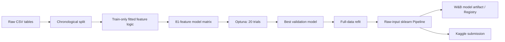

# XGBoost — training ექსპერიმენტების შეჯამება

ეს დოკუმენტი აჯამებს Walmart-ის კვირეული გაყიდვების პროგნოზირებისთვის ჩატარებულ XGBoost ექსპერიმენტებს: რა მიდგომები ვცადეთ, როგორ გადავედით baseline-იდან feature-rich მოდელზე, როგორ გამოვიყენეთ W&B ექსპერიმენტების სამართავად და რა ვისწავლეთ შედეგებიდან.

ძირითადი ფაილები:

- [`baseline_xgboost.ipynb`](./baseline_xgboost.ipynb) — საწყისი, შედარებით მარტივი XGBoost;
- [`model_experiment_XGBoost.ipynb`](./model_experiment_XGBoost.ipynb) — feature engineering, Optuna tuning, დიაგნოსტიკა, full refit და raw-input pipeline;
- [`basexgboost.md`](./basexgboost.md) — baseline notebook-ის დეტალური, cell-level აღწერა;
- [`../lightgbm/feature_engineering_explanation.md`](../lightgbm/feature_engineering_explanation.md) — feature-ების ტექნიკური აღწერა.

ამ README-ში feature-ების ფორმულებსა და თითოეული transformer-ის მიკრო-დეტალებს აღარ ვიმეორებთ. აქ მთავარი ყურადღება ეთმობა ექსპერიმენტების ლოგიკას, run-ებს, შედეგებსა და მათ ინტერპრეტაციას.

## მოკლე შედეგი

საწყისმა XGBoost baseline-მა 52-კვირიან validation-ზე მიიღო `WMAE = 2902.29`. იმავე 52-კვირიან ჰორიზონტზე feature engineering-ისა და hyperparameter tuning-ის შემდეგ შედეგი გახდა `WMAE = 1935.97`, რაც baseline XGBoost-თან შედარებით დაახლოებით **33.29% გაუმჯობესებაა**.

შემდგომი final-candidate run შესრულდა სხვა, 32-კვირიან validation ფანჯარაზე და მიიღო `WMAE = 1612.13`. ეს რიცხვი 52-კვირიანი run-ების შედეგებთან პირდაპირ შესადარებელი არ არის, რადგან შეფასების პერიოდი და სირთულე განსხვავებულია.

## ექსპერიმენტის განვითარების ლოგიკა

მუშაობა ოთხ ძირითად ეტაპად განვითარდა:

1. **Static baseline** — შევამოწმეთ, რამდენად ძლიერ შედეგს მოგვცემდა ერთი global XGBoost მხოლოდ წინასწარ ცნობილი tabular feature-ებით.
2. **Feature-rich მოდელი** — მოდელს დავუმატეთ გაყიდვების დონის, წლიური ისტორიის, კალენდრის, დღესასწაულებისა და promotion context-ის უფრო ძლიერი signal-ები.
3. **Optuna tuning** — ხელით შერჩეული ერთი კონფიგურაციის ნაცვლად შევადარეთ 20 hyperparameter combination.
4. **Production-style pipeline** — preprocessing, historical state და XGBoost ერთ ობიექტში გავაერთიანეთ, რათა მოდელმა პირდაპირ raw `test.csv` მიიღოს.



მთავარი იდეა იყო, რომ model quality, experiment tracking და inference ერთიან პროცესად გვექცია. კარგი validation score საკმარისი არ არის, თუ იგივე preprocessing-ის ზუსტად გამეორება test-ზე რთულია.

## რა ვცადეთ

| ეტაპი | მთავარი კითხვა | მიდგომა | შედეგი |
|---|---|---|---:|
| Median benchmark | სწავლობს თუ არა მოდელი მარტივ historical level-ზე მეტს? | Store/Dept median, fallback-ებით | `3305.52` WMAE, 52 კვირა |
| Static XGBoost baseline | რამდენად მუშაობს global tree model რთული history feature-ების გარეშე? | 22 feature, ერთი global model | `2902.29` WMAE |
| Engineered XGBoost + tuning | რამდენს გვაძლევს history, holiday context და tuning ერთად? | 81 feature, 20 Optuna trial | `1935.97` WMAE, 52 კვირა |
| Final candidate | როგორ იქცევა არჩეული კონფიგურაცია უფრო ახლო validation პერიოდში? | იგივე არჩეული parameters, 32 კვირა | `1612.13` WMAE |
| Full refit და pipeline | შეგვიძლია თუ არა იგივე ლოგიკა raw test-ზე გავუშვათ? | fitted preprocessing + final XGBoost | submission და registry-ready bundle |

Baseline და engineered 52-კვირიანი run-ები ერთმანეთთან შედარებადია. 32-კვირიანი final candidate ცალკე შეფასებად უნდა წავიკითხოთ.

## validation-ის დიზაინი

Random split არ გამოგვიყენებია. ბოლო კვირები გამოიყო validation-ად, ხოლო ყველა transformer, რომელსაც target history სჭირდება, მხოლოდ წარსულ training ნაწილზე მოერგო.

ამის მიზეზი ბიზნეს-ლოგიკაა: რეალურ forecasting-ში მომავალი გაყიდვები უცნობია. ამიტომ validation-მაც იგივე შეზღუდვა უნდა გაიმეოროს.

Feature-rich ექსპერიმენტში:

- training aggregate-ები მიმდინარე target-ის გარეშე, shifted/expanding პრინციპით იქმნება;
- validation და test aggregate-ები მხოლოდ უკვე ნანახ training history-ზეა დაფუძნებული;
- მოკლე `lag_1`, `lag_4` და `lag_13` არ გამოგვიყენებია, რადგან მრავალკვირიან test horizon-ზე ისინი recursive prediction-ს მოითხოვდა;
- `SalesLag52` დავტოვეთ, რადგან test-ისთვის წინა წლის შესაბამისი გაყიდვები training history-ში უკვე არსებობს.

32-კვირიან split-ში გვქონდა:

- training: `326,856` row;
- validation: `94,714` row;
- feature-ები: `81`;
- validation-ზე `SalesLag52` coverage: `97.34%`.

## feature strategy — მაკრო ხედვა

Feature engineering-ის მიზანი არ ყოფილა უბრალოდ სვეტების რაოდენობის გაზრდა. feature-ები ოთხ განსხვავებულ კითხვას პასუხობდა:

- **რა არის სერიის ტიპური გაყიდვების დონე?** — Store/Dept და Type/Dept historical statistics;
- **რას აკეთებდა იგივე სერია წინა წელს?** — `SalesLag52`;
- **სად ვართ სეზონურ ციკლში?** — calendar და cyclical context;
- **რა სპეციალური გარემოა ამ კვირაში?** — holiday identity, holiday proximity და markdown/holiday interactions.

ყველაზე ძლიერი feature-ები აღმოჩნდა:

1. `Store_Dept_Sales_median`;
2. `Store_Dept_Sales_mean`;
3. `SalesLag52`;
4. `Type_Dept_Sales_median`;
5. Thanksgiving/Christmas context და markdown interactions.

აქედან ჩანს, რომ მოდელისთვის ყველაზე მნიშვნელოვანი იყო კონკრეტული Store/Dept სერიის **საბაზისო გაყიდვების მასშტაბი**. ამის შემდეგ დაემატა წლიური seasonality და დღესასწაულების ეფექტი. მხოლოდ macroeconomic ან calendar feature-ები ამოცანის მთავარ signal-ს ვერ ცვლიდა.

## Optuna hyperparameter tuning

Tuning შესრულდა 52-კვირიან chronological validation-ზე. Optuna-ს TPE sampler-მა შეაფასა 20 configuration, ხოლო თითოეული trial ცალკე W&B run-ად ჩაიწერა.

ძებნის სივრცე მოიცავდა:

- learning rate-სა და tree depth-ს;
- child weight-ს;
- row/column subsampling-ს;
- L1/L2 regularization-ს;
- split penalty-სა და histogram bin count-ს.

საუკეთესო trial-ის ძირითადი ხასიათი იყო:

- შედარებით დაბალი learning rate — `0.02536`;
- ღრმა ხეები — `max_depth = 12`;
- ზომიერი row sampling — `0.8595`;
- უფრო ძლიერი column sampling restriction — `0.7046`;
- ძლიერი L2 regularization — `reg_lambda = 9.8423`.

საუკეთესო trial იყო trial `0`:

- validation WMAE: `1935.97`;
- best iteration: `2219`;
- MAE: `1791.90`;
- RMSE: `4398.17`;
- holiday MAE: `2399.72`;
- non-holiday MAE: `1740.71`.

რამდენიმე სხვა trial ახლოს მივიდა საუკეთესო შედეგთან (`1943–1949` WMAE), ხოლო შედარებით სუსტი configuration-ები `2300+` დიაპაზონშიც გავიდა. დაკვირვება იყო, რომ ამ engineered feature space-ში დაბალი learning rate და საკმარისი tree capacity უფრო სტაბილური აღმოჩნდა; მხოლოდ დიდი learning rate-ით სწრაფი training უკეთეს generalization-ს არ ნიშნავდა.

## W&B run-ების ორგანიზაცია

ყველა run ინახება პროექტში:

[Walmart-Recruiting---Store-Sales-Forecasting](https://wandb.ai/kende23-n-a/Walmart-Recruiting---Store-Sales-Forecasting)

ერთი engineered experiment-ის run-ები ერთ `group`-ში ერთიანდება. `job_type` გვაჩვენებს run-ის როლს მთლიან პროცესში.

| W&B job type | რას წარმოადგენს | რა ინახება |
|---|---|---|
| `data-preparation` | მონაცემებისა და feature schema-ს ვერსია | row counts, date ranges, missingness, feature manifest, raw dataset artifact |
| `hyperparameter-tuning` | ერთი Optuna trial | parameters, iteration-level train/validation metrics, best iteration, final WMAE/MAE/RMSE |
| `tuning-summary` | ყველა trial-ის საერთო შედეგი | leaderboard table, best parameters, trials CSV artifact |
| `train-best-model` | არჩეული configuration-ის შეფასება | სრული metrics, learning curves, feature importance, prediction diagnostics |
| `full-refit` | ყველა labeled row-ზე საბოლოო training | final model, prediction statistics, submission artifact |
| `model-registration` | inference-ready pipeline | serialized raw-input pipeline, metadata, contract-test status, Registry link |

### მთავარი W&B run-ები

- [Static baseline — 52 weeks](https://wandb.ai/kende23-n-a/Walmart-Recruiting---Store-Sales-Forecasting/runs/pc46skfo)
- [Optuna tuning summary](https://wandb.ai/kende23-n-a/Walmart-Recruiting---Store-Sales-Forecasting/runs/mosu9yww)
- [Engineered best model — 52 weeks](https://wandb.ai/kende23-n-a/Walmart-Recruiting---Store-Sales-Forecasting/runs/d2j50ses)
- [Engineered full refit — 52-week experiment](https://wandb.ai/kende23-n-a/Walmart-Recruiting---Store-Sales-Forecasting/runs/oszf0cgi)
- [Final candidate — 32 weeks](https://wandb.ai/kende23-n-a/Walmart-Recruiting---Store-Sales-Forecasting/runs/1v4zt3kx)
- [Final-candidate full refit](https://wandb.ai/kende23-n-a/Walmart-Recruiting---Store-Sales-Forecasting/runs/5rxamhq3)

52-კვირიანი tuning experiment-ის group იყო `xgb-engineered-25de6b22`, ხოლო 32-კვირიანი final-candidate group — `xgb-engineered-fa4ba0a2`.

### რატომ არ შემოვიფარგლეთ მხოლოდ ერთი metric-ით

W&B-ში WMAE-სთან ერთად ჩავწერეთ:

- ჩვეულებრივი MAE და RMSE;
- holiday და non-holiday MAE;
- train/validation learning curves;
- weekly metrics;
- department-level metrics;
- actual-vs-predicted sample;
- residual distribution;
- gain-based feature importance.

WMAE გვაძლევს competition score-ს, მაგრამ არ გვეუბნება, სად უშვებს მოდელი შეცდომას. Department-level table-მა აჩვენა, რომ ზოგი იშვიათი ან არასტაბილური department ბევრად რთულია. მაგალითად, 32-კვირიან run-ში მაღალი WMAE ჰქონდა Department 65-სა და 39-ს, თუმცა მათ მცირე row count ჰქონდათ; უფრო მასშტაბურ სეგმენტებში რთული იყო Department 72 და 38.

ამიტომ საბოლოო შეფასება დაფუძნდა არა მხოლოდ ერთ aggregate score-ზე, არამედ error distribution-სა და კონკრეტულ სეგმენტებზე.

## შედეგების შედარება

| მოდელი | Validation | Features | WMAE | MAE | Holiday MAE | Non-holiday MAE | Median-ზე გაუმჯობესება |
|---|---:|---:|---:|---:|---:|---:|---:|
| Median benchmark | 52 კვირა | — | `3305.52` | — | — | — | — |
| Static XGBoost baseline | 52 კვირა | 22 | `2902.29` | `2727.65` | `3464.41` | `2665.61` | `12.20%` |
| Engineered + tuned XGBoost | 52 კვირა | 81 | `1935.97` | `1791.90` | `2399.72` | `1740.71` | `41.43%` |
| Final candidate | 32 კვირა | 81 | `1612.13` | `1585.96` | `1821.02` | `1578.36` | `32.49%` |

ყველაზე მნიშვნელოვანი სამართლიანი შედარება არის პირველი 52-კვირიანი XGBoost baseline და engineered+tuned მოდელი: WMAE `2902.29`-დან `1935.97`-მდე შემცირდა.

32-კვირიანი შედეგი უკეთესი რიცხვია, მაგრამ ეს არ ნიშნავს ავტომატურად უკეთეს მოდელს. მოკლე და უფრო გვიანი validation ფანჯარა განსხვავებულ მოთხოვნას ქმნის.

## რას გვასწავლის training curve

52-კვირიან tuned run-ში საუკეთესო iteration იყო `2219`, რის შემდეგაც early stopping-მა training გააჩერა. ეს აჩვენებს, რომ დაბალ learning rate-ს ბევრი boosting round სჭირდებოდა.

32-კვირიან final-candidate run-ში საუკეთესო iteration გახდა `999`, ანუ ზუსტად კონფიგურაციით დაშვებული ბოლო iteration. შესაბამისად, ამ run-ში early stopping-ს რეალური optimum არ უპოვია; შეფასებული მოდელი იყო 1000-tree ლიმიტით შეზღუდული final candidate.

ორივე run-ში training error validation error-ზე მნიშვნელოვნად დაბალი იყო. ეს გვაჩვენებს, რომ:

- ღრმა XGBoost-ს საკმარისი capacity აქვს Store/Dept-specific pattern-ების დასამახსოვრებლად;
- validation monitoring და regularization აუცილებელია;
- უფრო დაბალი train error თავისთავად უკეთეს forecasting-ს არ ნიშნავს.

## final refit, submission და artifacts

არჩეული validation configuration-ის შემდეგ მოდელი თავიდან იწვრთნება ყველა labeled row-ზე. boosting rounds-ის რაოდენობა validation model-ის საუკეთესო iteration-იდან მოდის.

W&B artifacts-ში ვინახავთ:

- XGBoost model JSON-ს;
- feature columns და მათი ზუსტი რიგს;
- fitted preprocessing objects-ს;
- experiment config-სა და metrics JSON-ს;
- feature importance CSV-ს;
- validation predictions-ს;
- Kaggle submission-ს;
- Optuna leaderboard-ს.

ამის მიზანია reproducibility: dashboard-ზე კარგი score-ის ნახვა საკმარისი არ არის — უნდა შეგვეძლოს იმავე model version-ის ჩამოტვირთვა და იმავე prediction flow-ის აღდგენა.

## raw-input pipeline

საწყისად final model, known-feature transformer და aggregate encoder ცალ-ცალკე ინახებოდა. ეს inference-ისას ზრდიდა რისკს, რომ training და test preprocessing ერთმანეთს აღარ დაემთხვეოდა.

საბოლოოდ ავაწყვეთ ერთი sklearn pipeline:

```text
raw test.csv
    ↓
RawWalmartFeatureTransformer
    ├── features.csv merge
    ├── stores.csv merge
    ├── fitted cleaning/calendar/holiday/markdown logic
    ├── stored training history → SalesLag52
    ├── fitted target aggregates
    └── final 81-column order
    ↓
fitted XGBRegressor
    ↓
Weekly_Sales prediction
```

Pipeline საკუთარ თავში ინახავს:

- external features table-ს;
- stores metadata-ს;
- observed training history-ს;
- fitted imputation values-ს;
- aggregate mappings-ს;
- feature order-ს;
- final XGBoost model-ს.

ამიტომ inference API მარტივდება:

```python
predictions = pipeline.predict(test_raw)
```

Pipeline-ისთვის დამატებულია ორი contract test:

1. მისი prediction უნდა ემთხვეოდეს notebook-ის manual preprocessing + model prediction-ს;
2. `joblib`-ით შენახვისა და ხელახლა ჩატვირთვის შემდეგ prediction არ უნდა შეიცვალოს.

ასევე ინარჩუნებს raw input row order-ს, რათა prediction სწორ `Id`-ს დაუკავშირდეს submission-ში.

## W&B Model Registry

Pipeline ინახება `walmart-xgboost-raw-pipeline` model artifact-ად და უკავშირდება W&B Registry collection-ს:

```text
wandb-registry-model/Walmart_XGBoost_Pipeline
```

არჩეულ version-ს აქვს aliases:

```text
champion
latest
```

Registry artifact-ში შედის pipeline, feature manifest, config, metrics და feature importance. `model_inference.ipynb`-ის ამოცანა იქნება `champion` version-ის ჩამოტვირთვა, pipeline-ის ჩატვირთვა და raw test-ზე `predict()`-ის გამოძახება.

შენიშვნა: notebook-ში registration cell დამატებულია, მაგრამ Registry-ში ახალი version მხოლოდ ამ cell-ის წარმატებით შესრულების შემდეგ გამოჩნდება.

## მთავარი დასკვნები

1. **Series identity და historical level იყო მთავარი signal.** Store/Dept mean და median feature importance-ში აშკარად დომინირებდა.
2. **Feature-rich pipeline-მა და tuning-მა ერთად დიდი გაუმჯობესება მოგვცა.** 52-კვირიან შეფასებაზე baseline-იდან engineered+tuned მოდელამდე WMAE დაახლოებით 33.29%-ით შემცირდა. Feature engineering-ისა და tuning-ის ინდივიდუალური წვლილის ზუსტად გასაყოფად ცალკე ablation run-ებია საჭირო.
3. **წლიური history პრაქტიკული იყო multi-step forecasting-ისთვის.** `SalesLag52` ძლიერი feature აღმოჩნდა და test horizon-ზე ხელმისაწვდომი იყო recursive prediction-ის გარეშე.
4. **Holiday demand კვლავ რთულია.** ორივე მთავარ run-ში holiday MAE non-holiday MAE-ზე მაღალი დარჩა.
5. **ერთი aggregate score პრობლემურ სეგმენტებს მალავს.** Weekly და department tables აუცილებელი გახდა იმის სანახავად, სად იყო error კონცენტრირებული.
6. **Tuning-ის შედეგი უნდა შეფასდეს იმავე split-ზე.** 52 და 32 კვირის score-ების პირდაპირ შედარება არასწორი იქნებოდა.
7. **Training-ის საბოლოო პროდუქტი მხოლოდ booster არ არის.** reproducible შედეგისთვის საჭიროა fitted preprocessing, historical state, feature order, model და metadata ერთ versioned pipeline-ში.
8. **W&B გამოვიყენეთ არა მხოლოდ chart-ებისთვის, არამედ lineage-ისთვის.** dataset → trial → selected model → full refit → registered pipeline კავშირი გვაძლევს ექსპერიმენტის სრულ ისტორიას.

## დარჩენილი სამუშაო

- feature-group ablation: history, holiday, markdown და aggregate ჯგუფების ცალ-ცალკე გავლენის გაზომვა;
- time-based cross-validation რამდენიმე cutoff-ზე;
- registered `champion` pipeline-ის გამოყენება `model_inference.ipynb`-ში;
- Kaggle submission score-ის დამატება W&B run-სა და მთავარ პროექტის README-ში.
